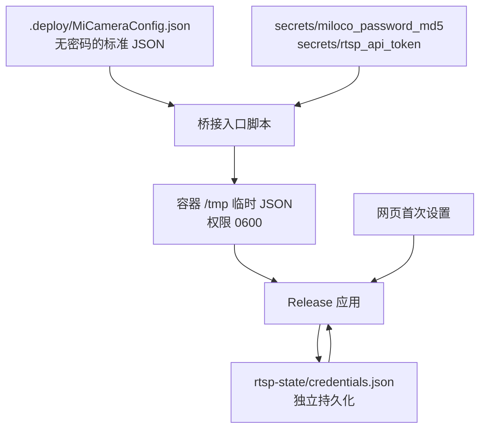

# ⚙️ 配置文件参考

下一篇：[01-桥接服务部署.md](01-桥接服务部署.md)

本页描述示例 Sample 服务器读取的 `MiCameraConfig.json`。

## 🌳 配置结构

```text
MiCameraConfig.json
├── Miloco                         上游地址、认证与证书
├── Streaming                      拉流超时与缓冲
├── Reconnect                      退避重连
└── MediaServer                    必须存在
    ├── ListenAddress / BearerToken / AllowedOrigins
    ├── FFmpeg                     原生库与 H.264 转码参数
    ├── Rtsp                       监听与凭据
    │   └── Streams[]              摄像头通道，三种输出共用
    ├── WebRtc                     UDP、ICE 与会话生命周期
    │   └── IceServers[]
    └── Snapshot                   JPEG 质量与生成间隔
```

## 🧭 Miloco

| 字段 | 类型 |  默认值  | 说明与约束 |
| --- | --- | --- | --- |
| `BaseUrl` | string | `https://192.168.5.100:8000` | 完整 HTTP/HTTPS 地址；Docker 使用实际局域网 IP |
| `Username` | string | `admin` | Miloco 本地服务账号，默认都是 `admin` |
| `Password` | string | 空 | 必填；Miloco 本地密码的小写32位 MD5。<br />**不是你的小米账号密码**；<br />首次部署时会提示你让你输入 6 位 pin 码，经过 MD5 加密后填入此项 |
| `AllowInvalidServerCertificate` | bool | `false` | 为 `true` 时跳过证书校验，包括固定证书校验；仅用于受控调试 |
| `TrustedServerCertificatePath` | string? | `null` | 本地 PEM 证书路径；关闭跳过校验时，HTTP 和 WebSocket 精确匹配同一张证书 |
| `RequestTimeout` | number | `15` 秒 | 登录及授权状态 HTTP 请求超时，必须大于 0 |

## 📡 Streaming 与 Reconnect

MiCamera.Net 从 Miloco 拉取视频的过程是基于 `WebSocket` 的流式传输。

`Streaming` 配置拉流超时和缓冲，`Reconnect` 配置退避重连策略。

对外播放使用 RTSP / WebRTC 进行转发。

| 字段 | 类型 | 默认值 | 说明与约束 |
| --- | --- | --- | --- |
| `Streaming.ConnectTimeout` | number | `10` 秒 | WebSocket 建连超时，> 0 |
| `Streaming.FirstKeyFrameTimeout` | number | `60` 秒 | 建连后迟迟没有首个关键帧，触发重连，> 0 |
| `Streaming.IdleTimeout` | number | `60` 秒 | 长时间没有收到视频数据，触发重连，> 0 |
| `Streaming.MaxMessageBytes` | int | `4194304` 字节 | 拒绝超过限制的上游二进制视频消息，触发重连，> 0 |
| `Streaming.SubscriberBufferCapacity` | int | `32` 个块 | 设置每个下游订阅者的缓冲容量；同时用于上游接收队列，至少为 `4`<br />容量增加会增加内存占用 |
| `Reconnect.InitialDelay` | number | `1` 秒 | 首次退避等待，> 0 |
| `Reconnect.MaximumDelay` | number | `30` 秒 | 退避上限，必须 ≥ `InitialDelay` |
| `Reconnect.BackoffMultiplier` | number | `2` | 退避倍率，≥ 1 |
| `Reconnect.JitterRatio` | number | `0.2` | 随机扰动比例，0–1；降低多路同时重连的概率 |

## 🌐 MediaServer：HTTP 与跨域

| 字段 | 类型 | 默认值 | 说明与约束 |
| --- | --- | --- | --- |
| `ListenAddress` | string | `http://127.0.0.1:5080` | 完整 HTTP/HTTPS 监听 URL；HTTPS 还需宿主证书配置，仅改 scheme 不会自动提供证书 |
| `BearerToken` | string | 空 | 非回环监听必填；配置后所有 API 均需 Bearer，包括健康与 RTSP 设置接口 |
| `AllowedOrigins` | string[] | `[]` | 允许的浏览器源，包含协议、主机和端口，例如 `http://localhost:5081`；不写 API 路径 |

`0.0.0.0` 是监听所有网卡的地址，访问时改用服务器 IP。源码前端直连 API 需要匹配 CORS；Docker 前端经 Nginx 同源代理访问 `/api`，Token 由代理添加，浏览器无需填写。

## 🎞️ MediaServer.Rtsp

| 字段 | 类型 | 默认值 | 说明与约束 |
| --- | --- | --- | --- |
| `ListenAddress` | string | `127.0.0.1` | IP 地址，不接受主机名 |
| `Port` | int | `8554` | TCP 端口，1–65535 |
| `PathPrefix` | string | `/live` | 非空且以 `/` 开头；URL 为 `rtsp://地址:端口/前缀/StreamId` |
| `Username`、`Password` | string | 空 | 静态 Digest 凭据，必须一起配置；非回环静态模式必填 |
| `CredentialsFilePath` | string? | `null` | 网页凭据模式的绝对路径；启用时静态用户名和密码必须为空 |
| `RtpMtu` | int | `1200` 字节 | RTP 包上限，至少 300；影响拆包，不是分辨率或码率 |
| `SessionTimeout` | number | `60` 秒 | RTSP 会话保活超时，> 0 |
| `Streams` | array | `[]` | 示例宿主从此处读取核心流列表；至少配置一条 |

只支持 RTP/RTCP over TCP。网页凭据模式要求父目录已经存在且可访问；文件不存在时 RTSP 等待初始化，文件损坏、版本不支持或不可读时启动失败。

网页用户名允许 1–64 位字母、数字、`.`、`_`、`-`；密码为 1–256 个字符，不得为纯空白或包含控制字符。该接口只允许初始化一次，不提供改密、找回功能。Docker 文件位置为 `.deploy/rtsp-state/credentials.json`，保存格式由服务维护，不要手工填入运行时 JSON。

### 📷 Streams[]：每个摄像头通道

| 字段 | 类型 | 默认值 | 说明与约束 |
| --- | --- | --- | --- |
| `StreamId` | string | 空 | 必填，对外流标识；忽略大小写后必须唯一，推荐使用 `living-room` 一类名称 |
| `CameraDeviceId` | string | 空 | 必填，Miloco 摄像头列表中的 DID，区别于显示名称 |
| `Channel` | int | `0` | ≥ 0；多镜头设备可能有多个通道，按实际设备填写 |
| `Codec` | string | `H265` | `H264` 或 `H265`，必须与上游实际输出一致 |
| `NominalFrameRate` | number | `25` fps | 1–120；只在缺少有效时间信息时回退，不会提升摄像头真实帧率 |

`CameraDeviceId + Channel` 不得重复。RTSP、截图和 WebRTC 使用同一份流列表。写错 `Codec` 会导致关键帧无法识别，不能通过单纯延长超时解决。

## 🧩 MediaServer.FFmpeg

| 字段 | 类型 | 默认值 | 说明与约束 |
| --- | --- | --- | --- |
| `Path` | string | 空 | FFmpeg 7.1 兼容原生动态库目录；空值采用系统搜索路径，相对路径按应用输出目录解析 |
| `H264EncoderName` | string | `libx264` | 转码编码器；必须由实际原生库提供 |
| `H264Bitrate` | int | `2500000` bit/s | H.264 转码目标码率，> 0 |
| `H264Preset` | string | `veryfast` | 编码器 preset；由编码器支持情况决定 |
| `H264MaxWidth`、`H264MaxHeight` | int | `0 / 0` 像素 | 两者同时为 0 时保留源尺寸；否则同时为 ≥ 64 的偶数，按比例限制转码输出尺寸 |
| `KeyFrameInterval` | number | `2` 秒 | 转码关键帧间隔，> 0 |

Windows 可使用 `C:\ffmpeg\bin`，JSON 中写成 `"C:\\ffmpeg\\bin"`；这里需要动态库目录，不是 `ffmpeg.exe` 路径。转码参数作用于 H.265→H.264 输出；H.264 源直通、原编码 RTSP 和原尺寸截图不按这些参数重新编码。

缺少 FFmpeg 时，RTSP 原编码直通仍可工作；截图和 H.265 WebRTC 转码不可用。健康就绪接口要求完整媒体能力，不能把 RTSP 可播放直接等同于整体就绪。

## 📺 MediaServer.WebRtc

| 字段 | 类型 | 默认值 | 说明与约束 |
| --- | --- | --- | --- |
| `Enabled` | bool | `true` | 开启 WebRTC 信令及媒体输出 |
| `BindAddress` | string? | `null` | UDP 绑定 IP；`null` 使用库默认选择，Docker 显式设为 LAN IP |
| `PortRangeStart`、`PortRangeEnd` | int? | `null / null` | 两端同时配置或同时省略；起点为偶数且 1–65534，终点 1–65535，起点 ≤ 终点 |
| `IceServers` | array | `[]` | 可选 STUN/TURN 配置；增加服务器不等于已完成公网部署 |
| `IceGatheringTimeout` | number | `5` 秒 | 服务端收集 ICE 的等待时间，> 0 |
| `PendingSessionTimeout` | number | `30` 秒 | 协商开始后等待实际连接的期限，> 0；仅提交 answer 不能阻止过期 |
| `DisconnectedGracePeriod` | number | `15` 秒 | 已连接会话断连后的宽限期，> 0 |
| `PlayoutDelay` | number | `0.8` 秒 | 发送预留缓冲，≥ 0；吸收上游突发交付，增加时也增加延迟 |
| `TranscoderIdleTimeout` | number | `10` 秒 | 无 H.264 订阅者后的转码保留时间，≥ 0 |
| `MaxPeersPerStream` | int | `4` | 每流 WebRTC 会话上限，至少 1；超限返回 429 |

`IceServers[]` 每项包含 `Url`（string，默认空）、`Username`（string，默认空）和 `Credential`（string，默认空）。空 URL 项不会传给 WebRTC 库；凭据应保存在受控配置中。

## 🖼️ MediaServer.Snapshot

| 字段 | 类型 | 默认值 | 说明与约束 |
| --- | --- | --- | --- |
| `Enabled` | bool | `true` | 开启 JPEG 截图 |
| `JpegQuality` | int | `85` | 1–100，只影响 JPEG 编码质量 |
| `Interval` | number | `5` 秒 | 截图生成最小间隔，≥ 0；0 表示每个关键帧都可生成 |

截图在关键帧到来时生成，HTTP 返回缓存中最近一次结果，不是每次请求都抓取新帧。因此 `Interval=5` 不保证恰好每五秒都有新图，仍受关键帧与上游收帧影响。

## 🧭 配置从哪里读取？

| 场景 | 配置来源 | 修改后如何生效 |
| --- | --- | --- |
| Debug 源码调试 | 固定读取 `AppContext.BaseDirectory/Configs/MiCameraConfig.json`；忽略传入的配置路径 | 修改源码示例配置后重新构建、启动；该文件会复制到输出目录 |
| Release 源码运行或发布产物 | 必须传入一个配置文件路径，无默认路径 | 修改指定文件后重新启动 |
| Docker 部署 | `.deploy/MiCameraConfig.json` 只读挂载，容器入口补入两个 secret，生成权限 `0600` 的临时 JSON，再将路径传入 Release 应用 | 修改外置配置后重新运行部署向导，使桥接容器重建 |
| 网页首次设置 RTSP | `MediaServer.Rtsp.CredentialsFilePath` 指定的独立文件 | 保存成功即开始监听；重启后从文件恢复 |

应用本身不通过环境变量或 secret 文件覆盖 JSON。Docker 的合成是入口脚本的职责。配置不支持热重载；RTSP 首次网页初始化是独立的运行时操作。

宿主解析器支持 `//` 和 `/* ... */` 注释，字段名不区分大小写；**Docker 外置 JSON 必须是无注释的标准 JSON**，因为容器入口使用 Python JSON 解析器。所有时长字段均使用数值秒，可以为小数，例如 `"PlayoutDelay": 0.8`；不接受 `"00:00:15"`。


### 📌 默认值的三个来源

下方字段表中的“默认值”指字段省略时的代码值；仓库示例与向导会显式设置部分字段。不要将 [性能记录](SERVER_PERFORMANCE.md) 中某台服务器的调优值作为全局默认值。

| 字段 | 代码默认值 | 仓库示例值 | 新部署向导生成值 |
| --- | --- | --- | --- |
| `Miloco.BaseUrl` | `https://miloco:8000` | 某台开发服务器地址 | `https://所选LAN_IP:8000` |
| `Miloco.AllowInvalidServerCertificate` | `false` | `true` | `false`，同时固定 PEM 证书 |
| `MediaServer.ListenAddress` | `http://127.0.0.1:5080` | `http://localhost:5080` | `http://所选LAN_IP:5080` |
| `MediaServer.FFmpeg.Path` | 空字符串 | `./ffmpeg` | `/app/native` |
| `MediaServer.FFmpeg.H264MaxWidth/Height` | `0 / 0` | 未设置，即 `0 / 0` | `1920 / 1080` |
| `MediaServer.WebRtc.PlayoutDelay` | `0.8` 秒 | `1.2` 秒 | `0.5` 秒 |
| RTSP 凭据模式 | 静态配置 | 回环监听，静态凭据为空 | 独立凭据文件，等待网页首次设置 |

这里的向导值只适用于首次生成配置；已有配置不会自动被默认值覆盖。


未提供固定证书且未跳过校验时，使用正常 TLS 证书校验。部署固定路径为 `/run/configs/miloco-server-cert.pem`。本地登录成功后仍需验证小米账号授权，HTTP 200 本身不代表已经授权。


## 📝 单路与多路配置示例

以下是 **Release 源码宿主** 的单路配置，使用回环端口。将密码 MD5、DID、上游地址和 PEM 路径替换为自己的值；文件放在未纳入版本控制的位置。不要直接用它替换向导生成的 Docker 配置。

```json
{
  "Miloco": {
    "BaseUrl": "https://192.168.1.10:8000",
    "Username": "admin",
    "Password": "REPLACE_WITH_LOCAL_PASSWORD_MD5",
    "AllowInvalidServerCertificate": false,
    "TrustedServerCertificatePath": "C:\\secure-config\\miloco-cert.pem",
    "RequestTimeout": 15
  },
  "Streaming": {
    "ConnectTimeout": 10,
    "FirstKeyFrameTimeout": 60,
    "IdleTimeout": 60,
    "MaxMessageBytes": 4194304,
    "SubscriberBufferCapacity": 32
  },
  "Reconnect": {
    "InitialDelay": 1,
    "MaximumDelay": 30,
    "BackoffMultiplier": 2,
    "JitterRatio": 0.2
  },
  "MediaServer": {
    "ListenAddress": "http://127.0.0.1:5080",
    "BearerToken": "",
    "AllowedOrigins": ["http://127.0.0.1:5081"],
    "FFmpeg": {
      "Path": "C:\\ffmpeg\\bin",
      "H264EncoderName": "libx264",
      "H264Bitrate": 2500000,
      "H264Preset": "veryfast",
      "H264MaxWidth": 1920,
      "H264MaxHeight": 1080,
      "KeyFrameInterval": 2
    },
    "Rtsp": {
      "ListenAddress": "127.0.0.1",
      "Port": 8554,
      "PathPrefix": "/live",
      "Username": "",
      "Password": "",
      "RtpMtu": 1200,
      "SessionTimeout": 60,
      "Streams": [
        {
          "StreamId": "living-room",
          "CameraDeviceId": "REPLACE_WITH_CAMERA_DID",
          "Channel": 0,
          "Codec": "H265",
          "NominalFrameRate": 25
        }
      ]
    },
    "WebRtc": {
      "Enabled": true,
      "BindAddress": null,
      "PortRangeStart": null,
      "PortRangeEnd": null,
      "IceServers": [],
      "IceGatheringTimeout": 5,
      "PendingSessionTimeout": 30,
      "DisconnectedGracePeriod": 15,
      "PlayoutDelay": 0.8,
      "TranscoderIdleTimeout": 10,
      "MaxPeersPerStream": 4
    },
    "Snapshot": { "Enabled": true, "JpegQuality": 85, "Interval": 5 }
  }
}
```

多路配置仅替换 `MediaServer.Rtsp.Streams` 数组。下面两个 DID 必须分别替换为真实设备值；同一双摄设备则可以使用相同 DID、不同通道。

```json
[
  { "StreamId": "living-room", "CameraDeviceId": "CAMERA_DID_A", "Channel": 0, "Codec": "H265", "NominalFrameRate": 25 },
  { "StreamId": "bed-room", "CameraDeviceId": "CAMERA_DID_B", "Channel": 0, "Codec": "H265", "NominalFrameRate": 25 }
]
```

## 🗝️ Docker 配置与凭据合成



外置配置的 `Miloco.Password` 和 `MediaServer.BearerToken` 保持为空，由入口注入。`miloco_jwt_secret` 单独供 Miloco 使用；不会注入桥接 JSON。RTSP 密码由网页设置并单独持久化，不写入镜像、流配置或浏览器存储。宿主机管理员仍能读取部署文件，备份整个 `.deploy` 时必须保护备份中的秘密。


---

下一篇：[01-桥接服务部署.md](01-桥接服务部署.md)
