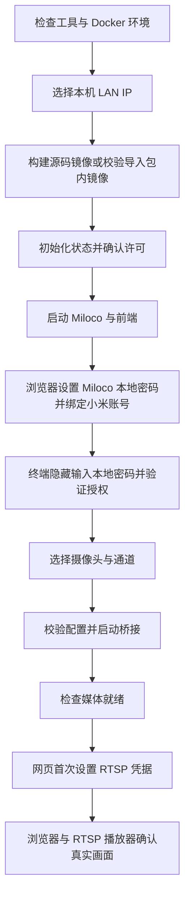

# 🚀 桥接服务部署

上一篇：[00-配置文件参考.md](00-配置文件参考.md)<br />
下一篇：[02-架构与实现.md](02-架构与实现.md)

推荐在构建机器上从源码生成完整部署包，再在与摄像头互通的 Linux 服务器上解压运行。也可从 [GitHub Releases](https://github.com/mm7h/MiCamera.Net/releases) 下载已经上传的构建包，或在服务器源码目录直接运行向导构建部署。

## 🧭 部署环境与服务组成

服务器需要原生 Linux amd64/arm64、本机 rootful Docker Unix socket、Docker Engine、Compose v2.20+、Bash 4+、iproute2（`ip`/`ss`）、awk、coreutils 和 util-linux（`flock`）。缺少工具时向导提示，不自动安装系统软件或修改防火墙。

不支持远程 Docker context、rootless Docker、Windows Docker、Docker Desktop 部署向导或未配置媒体网络的云服务器。WSL Shell 不等于原生 Linux host 网络；Docker Desktop 可用于构建与隔离检查，不能直接使用这里的 LAN IP 绑定。参见 [Docker host 网络说明](https://docs.docker.com/engine/network/drivers/host/)。

服务器、摄像头和浏览器应在同一可互通家庭局域网；访客 Wi-Fi、AP 隔离与 VLAN 防火墙可能阻断媒体。预构建包需要在线拉取 Miloco，并完成小米账号授权。源码构建还需访问 NuGet、npm、Debian 与基础镜像仓库。

| Compose 服务 | 职责 | 网络方式 |
| --- | --- | --- |
| `miloco` | 本地登录、小米授权与原始视频；持久化账号数据和证书 | host 网络，监听所选 LAN IP |
| `bridge` | .NET 自包含宿主、RTSP、JPEG、WebRTC 与认证 API | host 网络，直接提供 TCP/UDP 媒体端点 |
| `web` | React 静态页面，Nginx `/api` 代理自动附加 Token | LAN IP 的 5081 映射到容器 8080 |

Miloco 使用固定社区镜像 `ghcr.io/miiot/miloco:260618@sha256:1627132b4364feea0a60d2c880bacdbea614904a04ec2d4d457143d2fb5f7b68`，不是 Xiaomi 官方发布镜像。启动适配器关闭其视觉 JPEG 注册和无限增长的文件日志，保留原视频、鉴权和控制台日志；不提供 Miloco AI/视觉功能，不启动 OpenClaw、Python micam、go2rtc 或 GPU 服务。

使用前阅读 [第三方依赖许可](../deployment/THIRD-PARTY-NOTICES.md)，尤其是 Miloco 用途限制、SIPSorcery 附加限制以及 FFmpeg 分发义务。向导输入 `YES` 仅记录已阅读，不是授权证明。

## 📦 获取部署包或直接从源码部署

### 方式 A：源码生成完整包（推荐）

按照 [构建包指南](04-源码开发与构建包.md) 运行 `deployment/build-package.py`，取得 `deployment/build_output/` 中对应架构的 `.tar.gz` 和 `.sha256`，复制到服务器。以自建 `local-build` amd64 包为例：

```bash
sha256sum -c micamera-net-local-build-linux-amd64.tar.gz.sha256
tar -xzf micamera-net-local-build-linux-amd64.tar.gz
cd micamera-net-local-build-linux-amd64
bash deploy.sh
```

### 方式 B：下载 Release 包

打开 [Releases](https://github.com/mm7h/MiCamera.Net/releases)，下载目标版本的 `micamera-net-<版本>-linux-amd64.tar.gz` 或 `linux-arm64.tar.gz` 及其 `.sha256`。若目标版本尚未上传资产，使用方式 A；不要将源码 ZIP 当作预构建包。

校验、解压后在包目录运行 `bash deploy.sh`。向导验证包内文件、架构、镜像 ID 后导入镜像，不执行源码编译。Miloco 不在离线归档中，首次仍在线拉取。

### 方式 C：服务器源码目录直接部署

```bash
git clone https://github.com/mm7h/MiCamera.Net.git
cd MiCamera.Net
bash deploy.sh
```

此方式在服务器本地构建桥接和前端镜像，不生成可分发归档。部署前后端镜像内包含 FFmpeg 解码、JPEG 和 H.265→H.264 能力。源码从 Windows 上传时保持 Shell 文件为 LF；`bash deploy.sh` 不依赖执行位。

## 👋 首次启动向导



1. **选择地址**：选择本机 RFC1918 IPv4，建议在路由器固定 DHCP 租约。端口冲突时处理冲突，向导不静默换端口。
2. **确认许可**：阅读提示后输入 `YES`。按实际执行顺序，镜像构建/导入发生在交互许可确认之前；运行与分发前应自行核对许可。
3. **绑定账号**：在自己的电脑打开 `https://服务器IP:8000`，确认是本机 Miloco，再处理该地址的自签名证书提示；设置 Miloco 本地密码并绑定小米账号。脚本不打开 SSH 主机浏览器，不采集小米账号密码。
4. **验证授权**：终端隐藏输入 **Miloco 本地密码**，脚本转换成小写 MD5，并分别检查本地登录与 `data.is_logged_in`。失败可以重试授权、重输密码或退出后续跑。
5. **选择摄像头**：从列表选择，或手工输入 DID。向导默认通道 0、H.265、回退帧率 25；编码和通道必须与实际设备匹配，设备离线会影响就绪。
6. **设置 RTSP**：桥接启动后访问 `http://服务器IP:5081`，填写用户名、密码及确认密码。设置前 RTSP 不监听，HTTP、截图与拉流可以运行；保存成功立即启用，无需重启。
7. **确认画面**：在网页启动预览并获取截图；在播放器打开 `rtsp://服务器IP:8554/live/StreamId`，选择 RTSP over TCP，在认证界面输入刚设置的凭据。

前端 `/api` 代理会自动附加 Bearer Token，浏览器不需要输入 Token。首个访问者可初始化 RTSP，没有额外管理员登录，因此只在可信局域网部署。网页确认密码仅用于前端校验；服务端保存用户名与密码。

初始化或视频检查失败时脚本退出非零，但保留服务、授权及配置；重新运行可继续。媒体已就绪但 RTSP 等待网页设置时，向导可正常结束，完整 `/api/health/ready` 仍返回 503。不要交替使用普通用户与 `sudo` 运行，以免状态目录所有权混乱。

## 🌐 地址与防火墙

| 服务 | 默认地址 / 端口 | 认证与用途 |
| --- | --- | --- |
| Miloco | `https://服务器IP:8000` | 本地登录、小米授权 |
| HTTP API | `http://服务器IP:5080/api` | Bearer Token |
| 前端 | `http://服务器IP:5081` | 可信 LAN 页面与同源 API 代理 |
| RTSP | `rtsp://服务器IP:8554/live/StreamId` | Digest；RTP/RTCP over TCP |
| WebRTC 媒体 | UDP `50000–50100` | ICE、DTLS、SRTP，与浏览器直接通信 |

仅向可信局域网允许上述端口，禁止路由器公网转发。host 网络服务没有 Compose `ports` 映射；前端映射到选定 IP。脚本不修改防火墙。Nginx HTTP 同源代理只处理信令，不代理 WebRTC UDP 视频。

当前部署使用 LAN 明文 HTTP，不能套用于不可信网络或公网。向导的状态校验要求这里列出的固定端口，不能仅修改 JSON 来自定义端口；自行维护其他部署方案时，还需调整脚本校验、Compose、健康检查、代理、API 地址、CORS 和防火墙。

## 🗂️ 状态目录、秘密与证书

`.deploy` 被 Git 和 Docker 构建上下文排除，目录权限为 `0700`。不要将它复制进源码提交、镜像构建上下文或公开工单。

```text
.deploy/
├── deployment.env                 LAN_IP
├── settings.json                  lanIp
├── license-ack                    许可阅读记录
├── MiCameraConfig.json            无密码运行配置
├── MiCameraConfig.previous.json   最近一次配置替换前副本（如有）
├── secrets/
│   ├── miloco_password_md5
│   ├── miloco_jwt_secret
│   └── rtsp_api_token
├── rtsp-state/
│   └── credentials.json           网页设置后才存在
└── miloco/
    └── cert/cert.pem               此目录还包含数据库与小米授权资料
```

- **配置**：完整结构见 [配置参考](00-配置文件参考.md)。容器只读挂载外置 JSON，入口合成 `miloco_password_md5` 与 `rtsp_api_token` 为私有临时 JSON；正式镜像没有可运行的示例配置。
- **Secrets**：目录 `0700`，文件 `0644`，便于非 root 容器通过单文件挂载读取；外层目录限制宿主访问。Compose 按服务分配所需文件，Miloco 单独使用 JWT secret。
- **RTSP 凭据**：目录属于 UID/GID `10001`，权限 `0700`；文件 `0600`，仅桥接可写。重启、更新、添加摄像头及配置回退保留该文件；损坏或不可读时明确失败。
- **证书**：Miloco 生成的 PEM 被桥接只读挂载并精确固定，HTTP 与 WebSocket 不接受其他证书。浏览器访问 Miloco 的自签名证书例外仅针对已核对的本机地址。

镜像层和浏览器存储不保存上述秘密，但宿主机管理员与有权限读取部署文件的人仍能获取它们。

## 🤖 非交互部署

受控配置系统预置状态后运行：

```bash
bash deploy.sh up --non-interactive
```

需预置 `deployment.env`（只包含 `LAN_IP`）、`settings.json`、有效 `license-ack`、`MiCameraConfig.json`、`miloco/cert/cert.pem` 及三个 secrets；通过向导建立状态后交由配置系统管理，可避免手工猜测文件格式。

至少配置一条流，Miloco 用户名为 `admin`、密码字段为空、启用 PEM 固定；`miloco_password_md5` 为 32 位小写十六进制，JWT secret 和 API Token 各为 64 位小写十六进制。RTSP 静态凭据为空，`CredentialsFilePath` 固定为 `/run/rtsp-state/credentials.json`。它也可等待首次网页设置，不自动生成 RTSP 密码。

此模式不能自动绑定小米账号；尚未授权时退出非零，管理员完成 Miloco 网页授权后再次运行。旧 `bridge.env`、`miloco.env` 凭据布局不兼容，脚本不会迁移或删除；先受控备份，再移除旧文件并初始化新布局。

## 🔧 日常操作

| 命令 | 行为 |
| --- | --- |
| `bash deploy.sh` | 重用状态并启动；源码目录重建，包目录校验/导入 |
| `bash deploy.sh add-camera` | 添加设备通道，校验后重建桥接，当前播放会中断 |
| `bash deploy.sh status` | 容器状态、媒体就绪与 RTSP 初始化状态 |
| `bash deploy.sh logs` | 最近 100 行日志，不持续阻塞终端 |
| `bash deploy.sh stop` | 停止服务，保留配置和账号数据 |
| `bash deploy.sh build` | 准备部署状态并构建/导入镜像，不启动服务；不会生成完整包 |
| `bash deploy.sh credentials` | 仅在交互终端显式显示已设置 RTSP 凭据，不显示 Miloco 密码 |

新增流的 `StreamId` 忽略大小写后必须唯一，设备 DID 与通道组合也必须唯一。新配置先暂存，经运行时 JSON 合成检查后原子替换，并保留上一份；新增流未在 120 秒内就绪时回退原配置并重建桥接，不重启 Miloco。初次配置视频失败则保留新配置供排查，不退回空流。合成检查不等于真实收帧验证。

## 🔄 升级、备份与恢复

### 备份

先 `bash deploy.sh stop`，再以能读取 Miloco 数据的管理员身份备份 **整个 `.deploy`**，将归档保存在非公开、仅管理员可读的位置。授权数据库、JWT secret、证书、RTSP 凭据和配置必须一起备份；恢复时保持原所有权及权限。不要为修复启动故障清空账号目录。

### 升级与回退

源码部署更新源码后重新运行向导。包部署使用新版本包；保持新的部署文件与完整旧 `.deploy` 位于同一部署目录，避免在空目录重新授权。也可停止服务后，把完整状态连同权限恢复到新包目录，再启动。

首次从旧静态 RTSP 部署升级，向导备份 `MiCameraConfig.before-rtsp-setup.json` 并切换网页管理；旧 `secrets/rtsp_password` 留作回退但不再使用。需要网页重设一次，新凭据已存在时不重复重设。旧顶层媒体配置与 `Streams` 仍需按 [迁移表](00-配置文件参考.md) 手动调整。

Miloco 升级必须另行核对本地认证、`NormalResponse`、二进制 WebSocket 协议与许可，不直接换成 OpenClaw 插件接口。回退恢复已验证镜像和升级前状态，不假定数据库可降级。

部署成功后，脚本清理本项目遗留停止容器和部署前记录的旧桥接/前端镜像；保留仍被容器引用的镜像、其他项目标签和数据卷。构建或就绪失败时不清理旧镜像；`build` 不执行部署后清理。

### 密码、授权与 IP 变化

Miloco 本地密码变化后重新运行向导并输入新密码；小米授权失效时在 Miloco 网页重新绑定。全局退出登录可能使 Cookie 失效，桥接会重新认证和重连。

服务器 IP 变化时停止并备份，核对本机新 IP，更新 `deployment.env` 的 `LAN_IP`、`settings.json` 的 `lanIp`，以及 JSON 中 `Miloco.BaseUrl`、HTTP/RTSP 监听、`AllowedOrigins`、WebRTC 绑定地址，再运行向导。保持固定证书路径不变；浏览器使用新地址重新连接。旧 IP 不存在时脚本拒绝继续，不自动换网卡。

## ✅ 验收与性能边界

三服务日志均限制为每份 10 MB、3 份。原始 RTSP 与 JPEG 保留摄像头原编码/尺寸；H.265 WebRTC 使用 CPU 按需转码，新部署输出上限为 1920×1080。无观看者时只按需维护关键帧截图，截图默认最小间隔五秒。并发数与流畅度必须按主机、上游帧率和网络实测，不承诺任意硬件的性能。

部署后依次确认：容器存活 → 本地登录与小米授权 → `mediaReady` → 网页 RTSP 初始化 → 整体 `ready` → JPEG、RTSP 解码与浏览器实际播放。健康检查不能替代端到端画面验收；缺少原生库时 RTSP 可以工作，整体媒体就绪仍会失败。

当前留存证据见 [部署验收记录](DEPLOYMENT_VERIFICATION.md) 和 [服务器性能记录](SERVER_PERFORMANCE.md)：amd64 有真实摄像头检查，ARM64 有 QEMU 运行证据，仍需原生 ARM 验证；历史短测不等于最新版本通宵稳定或零冻结。记录中的旧测试入口已移除，不作为当前操作步骤。

---

上一篇：[00-配置文件参考.md](00-配置文件参考.md)<br />
下一篇：[02-架构与实现.md](02-架构与实现.md)
