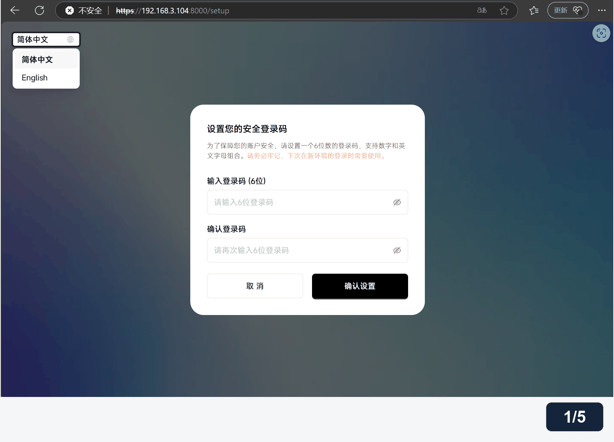
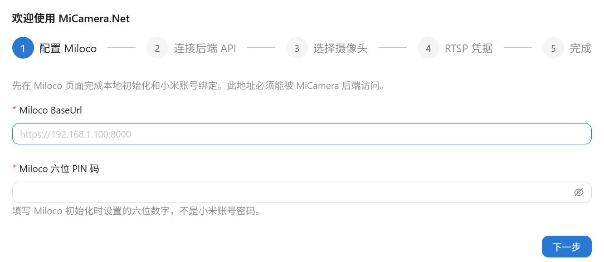

# 🚀 桥接服务部署

上一篇：[00-配置文件参考.md](00-配置文件参考.md)<br />
下一篇：[02-架构与实现.md](02-架构与实现.md)

本文介绍两种部署方式，最终都在 Linux 服务器上运行 Miloco、桥接服务和 Web 前端，并通过网页完成摄像头与 RTSP 配置。

| 部署方式 | 适用情况 | 需要做的工作 |
| --- | --- | --- |
| 下载 GitHub Release 镜像包 | 希望直接使用已发布版本 | 下载对应架构的包，在服务器校验、解压并启动 |
| 自行编译源码并打包 | 需要使用最新源码、自己的修改，或 Release 没有合适的包 | 在构建机器上生成镜像包，再复制到服务器部署 |

**当前配置方式**：`MiCameraConfig.json` 保留监听地址、拉流、重连和媒体处理参数；Miloco 地址与六位 PIN、摄像头列表、RTSP 用户名和密码通过网页管理，持久化到 SQLite。首次部署无需手工填写这些字段，也无需在终端输入 Miloco 密码或选择摄像头。

以下流程对应当前源码。使用历史 Release 时，应同时核对该版本包内的 `README.md` 和部署脚本说明。

## 🧰 部署前准备

### 运行服务器

两种方式对运行服务器的要求相同：

| 项目 | 要求 |
| --- | --- |
| 系统与架构 | 原生 Linux，`amd64` 或 `arm64` |
| 容器环境 | 本机 rootful Docker Engine，Docker Compose v2.20+，当前用户能够访问本机 Docker Unix socket |
| 命令行工具 | Bash 4+、iproute2（`ip`、`ss`）、awk、coreutils（含 `sha256sum`）、util-linux（`flock`）；解压包另需 `tar` |
| 局域网 | 服务器、摄像头和浏览器所在设备能够互通；服务器使用本机 RFC1918 IPv4 地址，建议固定 DHCP 租约 |
| 联网 | 首次拉取 Miloco 镜像、小米账号授权需要联网 |

服务器运行镜像包时，**无需安装 .NET、Node.js 或 Python**。部署脚本检查环境，但不会自动安装系统软件或修改防火墙。

部署向导不支持 Docker Desktop、rootless Docker、远程 Docker context 或 Windows Docker。Windows 上的 Docker Desktop 可以用于构建 Linux 镜像包，再将包部署到原生 Linux 服务器。

### 服务与端口

| Compose 服务 | 用途 | 默认访问地址 / 端口 |
| --- | --- | --- |
| `miloco` | 小米账号授权、设备发现与原始视频 | `https://服务器IP:8000` |
| `bridge` | HTTP API、RTSP、WebRTC 与 JPEG 截图 | HTTP TCP `5080`；RTSP TCP `8554`；WebRTC UDP `50000–50100` |
| `web` | Web 前端及同源 API 代理 | `http://服务器IP:5081` |

`miloco` 和 `bridge` 使用 host 网络；`web` 将服务器所选 IP 的 `5081` 映射到容器 `8080`。WebRTC 视频由浏览器直接通过 UDP 接收，Nginx 的 HTTP 代理只处理 API 和信令。

防火墙应允许可信局域网访问上述端口；访客 Wi-Fi、AP 隔离或 VLAN 规则可能阻断视频。当前方案使用局域网 HTTP，网页没有额外管理员登录，能够访问页面的人可以初始化或重新配置服务，因此不要将这些端口转发到公网。

部署使用 Compose 中固定版本与摘要的 `ghcr.io/miiot/miloco` 社区镜像。使用前阅读 [第三方依赖许可](../deployment/THIRD-PARTY-NOTICES.md)，核对 Miloco、SIPSorcery 和 FFmpeg 的使用与分发要求；部署向导中的 `YES` 仅记录确认，不授予许可。

## 📦 方式一：下载 GitHub Release 镜像包部署

此方式直接导入已编译好的桥接和前端镜像，服务器不执行源码编译。

### 1. 选择架构并下载

在运行服务器上查看架构：

```bash
uname -m
```

| 命令输出 | 应下载的包 |
| --- | --- |
| `x86_64` | `micamera-net-<版本>-linux-amd64.tar.gz` |
| `aarch64` 或 `arm64` | `micamera-net-<版本>-linux-arm64.tar.gz` |

打开 [GitHub Releases](https://github.com/mm7h/MiCamera.Net/releases)，在目标版本的 Assets 中下载：

- 对应架构的 `.tar.gz` 镜像包。
- 同名的 `.tar.gz.sha256` 校验文件。

将两份文件放到服务器上的同一个目录。GitHub 自动提供的 **Source code (zip/tar.gz)** 是源码归档，不是镜像部署包；如果当前版本没有所需架构的镜像包，使用方式二自行构建。

### 2. 校验、解压并启动

进入下载文件所在目录。将下面的 `PACKAGE` 改为实际包文件名，去掉末尾的 `.tar.gz`：

```bash
PACKAGE='micamera-net-实际版本-linux-amd64'
sha256sum -c "${PACKAGE}.tar.gz.sha256"
tar -xzf "${PACKAGE}.tar.gz"
cd "$PACKAGE"
bash deploy.sh
```

确认校验输出为 `OK` 后再解压；校验失败时重新下载，不继续部署。ARM64 使用实际的 `linux-arm64` 包名。

包内主要内容如下：

```text
micamera-net-<版本>-linux-<架构>/
├── README.md
├── deploy.sh
├── docker-compose.yml
├── images.tar                    桥接与前端镜像
├── SHA256SUMS                    包内文件校验
└── deployment/
    ├── package.env               版本、架构、镜像标签与 ID
    ├── miloco-entrypoint.py
    └── THIRD-PARTY-NOTICES.md
```

向导还会校验包内文件、主机架构和镜像 ID，再使用 `docker load` 导入 `images.tar`。保留完整解压目录，不要只复制镜像文件。

**镜像包不包含 Miloco 镜像或账号数据**。Miloco 镜像在首次启动时在线拉取，所以此包不能直接视为完全离线部署包。服务启动后继续按下文完成首次初始化。

## 🛠️ 方式二：自行编译源码并打包部署

此方式先在构建机器上编译前后端、构建镜像并生成完整部署包，再将包复制到运行服务器。构建机器与运行服务器可以是同一台，也可以是两台不同的机器。

### 1. 准备构建环境

构建机器需要：

- Python 3.13.2（本机构建环境使用的版本，建议复现时使用相同版本）。
- Docker Engine 或 Docker Desktop 的 Linux 容器引擎，以及 Docker buildx。
- Git（用于获取源码）。
- 能够访问基础镜像仓库、NuGet、npm 和 Debian 软件源的网络。

先确认构建机器的解释器版本：Linux/macOS 执行 `python3 --version`，Windows PowerShell 执行 `python --version`；本机输出为 `Python 3.13.2`。`python3` / `python` 是命令名称，实际版本以输出为准。打包脚本只使用 Python 标准库，无需额外安装 pip 依赖。

.NET SDK、Node.js 和 FFmpeg 依赖由 Dockerfile 提供，无需单独安装到构建机器。跨架构构建还需目标平台执行能力，例如已配置的 QEMU/binfmt 或原生构建节点。

### 2. 获取源码并生成镜像包

```bash
git clone https://github.com/mm7h/MiCamera.Net.git
cd MiCamera.Net
python3 --version
docker buildx version
python3 deployment/build-package.py local-build --arch amd64
```

已有本地源码时，直接在仓库根目录运行打包命令即可；当前工作区中的源码修改也会参与构建。需要基于指定版本部署时，先检出对应标签或提交。

Windows PowerShell 使用同一个脚本，将 `python3` 改为已安装的 `python`：

```powershell
python --version
python deployment/build-package.py local-build --arch amd64
```

`local-build` 是自定义包版本标识，可替换为字母或数字开头、仅包含字母、数字、点、下划线和连字符的名称，总长不超过 81 个字符。

| 目标架构 | 打包参数 | 归档文件 |
| --- | --- | --- |
| Linux x86-64 | `--arch amd64` | `micamera-net-local-build-linux-amd64.tar.gz` |
| Linux ARM64 | `--arch arm64` | `micamera-net-local-build-linux-arm64.tar.gz` |
| 同时生成两种架构的包 | `--arch all` | 分别生成 amd64 和 arm64 归档 |

省略 `--arch` 时默认构建两种架构，建议明确指定目标服务器架构。打包脚本执行 Docker 多阶段构建，发布 .NET 8 自包含应用、编译 Web 前端，随后导出镜像并生成校验文件。

构建成功后，产物位于 `deployment/build_output/`。以 amd64 为例，需要复制以下两份文件到服务器的同一个目录：

```text
deployment/build_output/
├── micamera-net-local-build-linux-amd64.tar.gz
└── micamera-net-local-build-linux-amd64.tar.gz.sha256
```

更多构建参数及复用已有镜像的方法见 [源码开发与构建包](04-源码开发与构建包.md)。

### 3. 在 Linux 服务器部署

进入服务器上存放这两份文件的目录：

```bash
sha256sum -c micamera-net-local-build-linux-amd64.tar.gz.sha256
tar -xzf micamera-net-local-build-linux-amd64.tar.gz
cd micamera-net-local-build-linux-amd64
bash deploy.sh
```

确认校验通过后再解压。版本和架构按实际产物替换。自建包与 Release 包具有相同的部署结构，服务器会校验并导入已构建的镜像；后续初始化与日常操作也相同。

`deployment/build-package.py` 才会生成可分发的完整归档。源码目录中的 `bash deploy.sh` 会在服务器本地构建并部署，`bash deploy.sh build` 只准备状态与构建镜像，两者都不生成 `.tar.gz` 包。

## 👋 两种方式通用：首次初始化

### 1. 完成终端部署向导

运行前面的 `bash deploy.sh` 后，按提示选择本机局域网 IPv4 地址，并确认已核对第三方许可。脚本会生成部署状态、导入镜像、启动三个服务，最后显示前端与 Miloco 地址。

终端检查通过表示服务已经启动，可以进入网页配置；此时尚未选择摄像头，也尚未启用 RTSP。首次网页配置完成前，`/api/health/ready` 返回 `503` 属于正常状态。

首次部署需要交互终端，SSH 登录服务器即可操作。后续继续使用同一用户运行脚本，避免普通用户与 `sudo` 交替操作造成状态目录所有权混乱。

### 2. 在 Miloco 绑定小米账号

在自己的电脑打开 `https://服务器IP:8000`：

1. 核对地址确实是本机部署的 Miloco，处理该地址的自签名证书提示。
2. 完成本地初始化，设置并记住 **六位数字 PIN**。
3. 按 Miloco 页面提示同意相关条款、绑定小米账号，并确认能看到需要使用的摄像头。

这个 PIN 是 Miloco 本地登录凭据，与小米账号密码、RTSP 密码不同。小米账号授权在 Miloco 页面完成。




### 3. 在 MiCamera 网页完成配置

打开 `http://服务器IP:5081`，首次访问会进入初始化向导，依次完成以下步骤：

| 网页步骤 | 填写或操作内容 |
| --- | --- |
| 配置 Miloco | 填写 `https://服务器IP:8000` 和刚设置的六位 PIN；地址必须能被桥接服务访问 |
| 连接后端 API | 镜像部署默认使用当前网站的同源代理，保留默认 API 地址、Token 留空，然后点击“连接并获取摄像头” |
| 选择摄像头 | 至少勾选一台设备，为每一路通道设置唯一的 `StreamId`；多镜头设备可展开“高级设置”增加通道 |
| RTSP 凭据 | 设置 RTSP 用户名、密码和确认密码，点击“保存并启用” |
| 完成 | 配置生效后点击“进入主页面” |

`StreamId` 用于对外播放地址，例如 `living-room`、`front-door`。它必须为 1–64 位英文字母、数字、连字符或下划线，首位是字母或数字，且不区分大小写后全局唯一；不支持中文。同一设备的同一通道不能重复配置。

高级设置默认通道 `0`、源编码 `H.265`、回退帧率 `25`。通道和编码应与摄像头实际输出一致；回退帧率不改变摄像头真实帧率。编码不匹配可能导致无法识别关键帧或黑屏。

网页经 Nginx 同源代理调用后端，代理自动附加 API Token。这里的 API 地址与 Miloco 地址是两个不同的入口，无需改成 Miloco 的 `8000` 地址。

配置保存后立即生效，无需重启后端。若页面提示“配置已保存但尚未生效”，点击“重试应用已保存的配置”，再确认进入主页面。



### 4. 验证真实播放

在主页面选择摄像头、启动 WebRTC 预览并确认截图可用。再用 VLC 等支持 RTSP 的播放器打开：

```text
rtsp://服务器IP:8554/live/living-room
```

将 `living-room` 替换为实际 `StreamId`，选择 **RTSP over TCP**，在播放器认证界面输入网页设置的 RTSP 用户名和密码。

在解压包目录运行：

```bash
bash deploy.sh status
```

确认容器运行、摄像头收帧以及媒体和 RTSP 就绪。`ready: true` 仍不能替代浏览器和播放器的实际画面检查。H.265 浏览器预览需要 CPU 转码，并发能力应按服务器性能实测。

## 🗂️ 配置与数据保存位置

首次部署后，包目录下会生成 `.deploy/`：

```text
.deploy/
├── deployment.env                Docker Compose 使用的 LAN_IP
├── settings.json                 部署脚本记录的 lanIp
├── license-ack                   许可确认记录
├── MiCameraConfig.json           基础运行参数
├── secrets/
│   ├── miloco_jwt_secret          Miloco 使用的 JWT secret
│   └── rtsp_api_token             桥接 API 与前端代理使用的 Token
├── micamera-state/
│   └── settings.db               网页管理的 SQLite 配置
└── miloco/                       Miloco 数据库、小米授权资料及证书
    └── cert/cert.pem
```

| 配置内容 | 管理方式 |
| --- | --- |
| HTTP / RTSP 监听、拉流超时、重连、FFmpeg、WebRTC 与截图参数 | `.deploy/MiCameraConfig.json`，字段说明见 [配置文件参考](00-配置文件参考.md) |
| Miloco 地址与 PIN 认证信息、摄像头通道列表、RTSP 用户名与认证信息 | 网页初始化或“重新配置”，持久化到 `.deploy/micamera-state/settings.db` |
| API Token、Miloco JWT secret | 部署脚本生成并通过 Docker secrets 挂载 |
| 小米账号授权和 Miloco 证书 | Miloco 自行生成并保存在 `.deploy/miloco/` |

不要再向 JSON 写入 `Miloco.BaseUrl/Username/Password`、`MediaServer.Rtsp.Streams` 或 RTSP 用户名、密码、`CredentialsFilePath`。这些用户配置由 SQLite 管理；旧的 `miloco_password_md5` secret 和 `rtsp-state/credentials.json` 不再作为当前服务的配置来源。

Docker 配置由向导生成，其中包括容器专用的证书、FFmpeg 路径和 UDP 绑定参数，不要直接用仓库里的本地开发配置替换。桥接入口读取只读 JSON 并注入 API Token，Miloco 连接固定使用挂载的 PEM 证书，正式部署保持证书校验开启。

`.deploy` 权限为 `0700`，应用状态目录由容器 UID/GID `10001` 管理，SQLite 文件权限为 `0600`。数据库保存 PIN 的 MD5 和 RTSP Digest 认证摘要，不回显原始密码；这些摘要仍是敏感认证资料，整个 `.deploy` 及其备份都应妥善保护。

网页配置可以即时应用；JSON 中的基础参数在后端启动时读取，修改后停止并重新启动服务。当前向导使用固定端口，不能只修改 JSON 来变更端口，还需同步调整部署校验、Compose、健康检查与代理。

## 🔧 日常维护

所有命令都在当前部署包的解压目录中执行：

| 操作 | 命令或入口 |
| --- | --- |
| 启动、恢复或重新运行部署 | `bash deploy.sh`，重用已有状态并校验镜像 |
| 查看容器和媒体就绪状态 | `bash deploy.sh status` |
| 查看最近 100 行服务日志 | `bash deploy.sh logs` |
| 停止服务并保留数据 | `bash deploy.sh stop` |
| 只准备部署状态与导入镜像，不启动 | `bash deploy.sh build` |
| 修改 Miloco 地址 / PIN、摄像头、RTSP 凭据 | 前端主页面的“重新配置” |

`bash deploy.sh add-camera` 和 `bash deploy.sh credentials` 保留为网页入口提示，不再在终端添加摄像头或显示密码。

重新配置保存后立即应用，已有 RTSP / WebRTC 播放连接会关闭，需要重新连接。编辑时 PIN 和 RTSP 密码留空可保留已保存的凭据；修改 RTSP 用户名时必须设置新密码。小米授权失效时先在 Miloco 网页重新绑定，再回到前端刷新设备。

### 非交互启动

已有有效部署状态时，可运行：

```bash
bash deploy.sh up --non-interactive
```

此模式需要已有 `deployment.env`、`settings.json`、有效的 `license-ack`、`MiCameraConfig.json`、Miloco 持久化目录与证书，以及两个 secrets。推荐先通过交互向导建立状态，再交由配置系统管理。

非交互启动不会完成小米账号绑定或网页初始化；没有已保存的 SQLite 配置时，服务仍会等待用户进入网页设置。

## 🔄 备份、升级与迁移

### 备份与恢复

先运行 `bash deploy.sh stop`，再以能读取部署数据的管理员身份备份 **整个 `.deploy/`**，保持原所有权和权限。SQLite 配置、Miloco 授权数据库与证书、两个 secrets 应一起备份，归档存放在非公开且仅管理员可读的位置。

恢复时将完整 `.deploy/` 放回相匹配的部署包目录，检查服务器 IP 和权限，再运行 `bash deploy.sh`。只复制 `MiCameraConfig.json` 不能恢复摄像头和认证配置。

### 更新镜像包

1. 停止旧部署并备份完整 `.deploy/`，同时保留旧包，以便回退。
2. 下载新 Release 包，或从新源码重新构建对应架构的包，校验并解压到新目录。
3. 将完整 `.deploy/` 连同权限与所有权复制到新包目录，不使用空状态重新授权。
4. 在新包目录运行 `bash deploy.sh`，通过网页、RTSP 播放器和 `status` 验证。

当前网页配置版本之间更新和重启会保留 SQLite 中的设置。部署成功后，脚本会清理本项目不再被容器引用的旧桥接 / 前端镜像；需要回退时，可从保留的旧包重新导入镜像，并恢复升级前的完整状态。不要假定新数据库可直接供旧版本使用。

从旧文件配置版本升级时，脚本会将原配置保存为 `.deploy/MiCameraConfig.before-web-setup.json`，再移除 JSON 中由网页管理的字段，**不会将旧凭据和摄像头列表导入 SQLite**。没有 SQLite 设置的旧部署需要在网页重新填写 Miloco 连接、选择摄像头并设置 RTSP 凭据；旧文件保留作备份，不代表仍会被读取。

如果检测到更早版本的 `.deploy/bridge.env` 或 `miloco.env`，脚本会拒绝继续。先完成备份，再移除旧布局文件并重新初始化。更早的顶层 `Streams`、`Rtsp` 等配置也需要调整，媒体参数位于 `MediaServer`，摄像头列表改由网页管理。

### 服务器 IP 变化

停止并备份部署后，将以下地址统一更新为本机的新局域网 IP：

- `.deploy/deployment.env` 中的 `LAN_IP`。
- `.deploy/settings.json` 中的 `lanIp`。
- `.deploy/MiCameraConfig.json` 中的 HTTP / RTSP 监听地址、`AllowedOrigins` 和 WebRTC 绑定地址。

然后重新运行 `bash deploy.sh`，使用新 IP 打开前端，在“重新配置”中更新 Miloco BaseUrl。保留原 Miloco 数据和证书；不要直接编辑 SQLite。已保存的 IP 不在本机网卡上时，脚本会拒绝启动，不会自动换地址。

## 🔍 部署问题排查

| 现象 | 优先检查 |
| --- | --- |
| 架构不匹配或校验失败 | `uname -m`、包名与 `.sha256` 是否对应；重新下载或按正确架构构建 |
| 脚本提示端口占用 | 处理 TCP `8000/5080/5081/8554` 的冲突；向导不会自动换端口 |
| 网页获取不到摄像头 | Miloco 地址、六位 PIN、账号绑定、家庭 / 设备范围及摄像头在线状态 |
| 首次启动 `ready: false` | 先完成网页初始化，再检查实际收帧和媒体能力 |
| 配置已保存但未生效 | 点击网页“重试应用已保存的配置”，结合 `status` 和 `logs` 检查 |
| RTSP 可播放但网页黑屏 | WebRTC UDP 端口、防火墙与网络隔离、源编码、FFmpeg 及 CPU 转码负载 |

初始化或启动失败时，已有配置和账号数据会保留，可排查后重新运行脚本。详细排查见 [故障排查](05-故障排查.md)；已有验证范围见 [部署验收记录](troubleshooting/DEPLOYMENT_VERIFICATION.md)，性能记录见 [服务器性能记录](troubleshooting/SERVER_PERFORMANCE.md)。

---

上一篇：[00-配置文件参考.md](00-配置文件参考.md)<br />
下一篇：[02-架构与实现.md](02-架构与实现.md)
