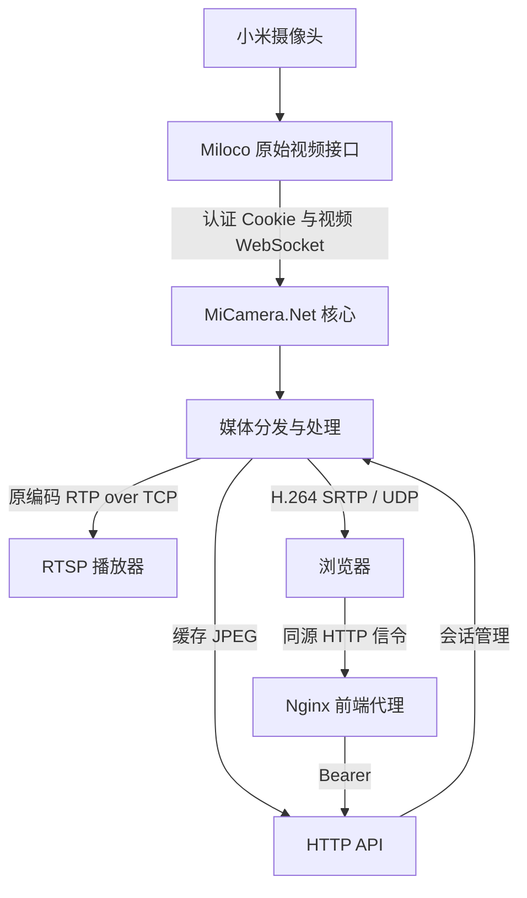
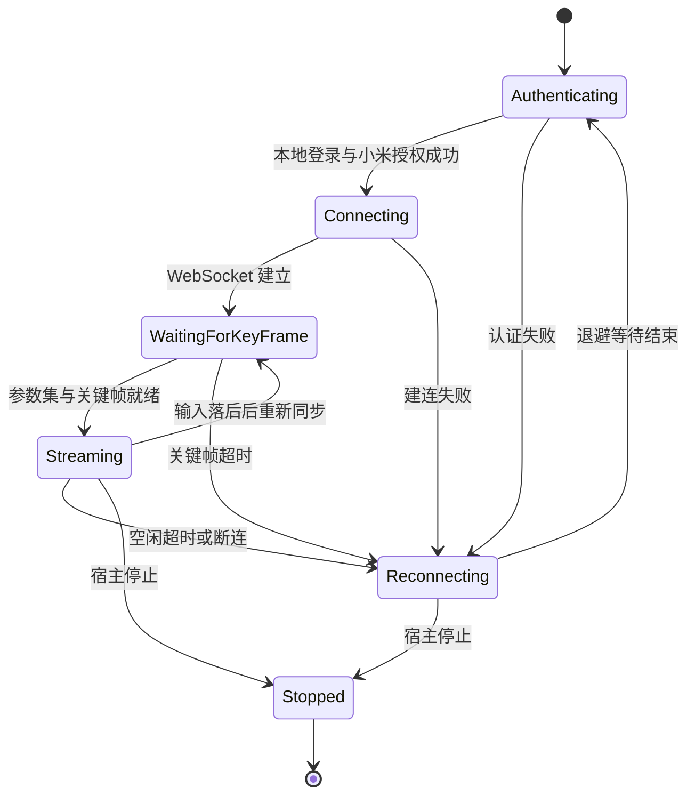
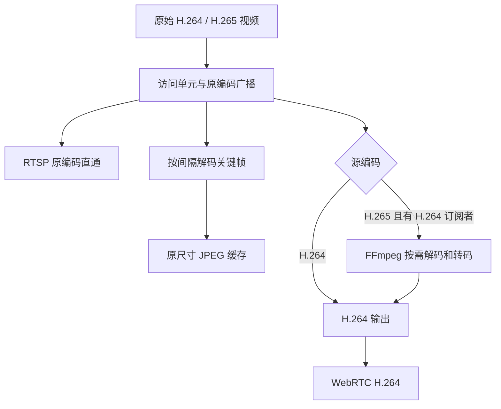

# 🧩 架构与实现

上一篇：[01-桥接服务部署.md](01-桥接服务部署.md) 
下一篇：[03-接口与SDK接入.md](03-接口与SDK接入.md)

MiCamera.Net 是连接 Miloco 原始视频接口的 .NET SDK 与桥接服务。它接收 H.264/H.265 Annex-B 视频，为同一组摄像头通道提供 RTSP 原编码直播、JPEG 截图和 H.264 WebRTC 预览。

## 🗺️ 系统全景

Docker 的同源代理用于 HTTP API；WebRTC 视频由桥接直接通过 UDP 发往浏览器。原生 SDK 宿主可直接暴露 API，不必使用 Docker 前端。

## 🧱 项目分层

| 项目 | 职责 |
| --- | --- |
| `MiCamera.Net.Abstractions` | 核心配置、视频块、状态、流描述、订阅接口与构建接口 |
| `MiCamera.Net` | Miloco HTTP 会话、Cookie 与证书验证，视频 WebSocket、关键帧同步、流分发和托管生命周期 |
| `MiCamera.Net.RTSP.Abstractions` | RTSP/HTTP/WebRTC/截图/媒体配置、媒体契约和 API DTO |
| `MiCamera.Net.Media` | Annex-B 处理、访问单元与时间轴、FFmpeg 原生解码、JPEG 和按需 H.265→H.264 转码 |
| `MiCamera.Net.RTSP` | RTSP 控制与 TCP RTP 发送、HTTP 控制器、Bearer 校验、SIPSorcery WebRTC 会话与反馈处理 |
| `MiCamera.Net.Sample.Server` | 配置文件解析及到 SDK 选项的映射，控制台宿主 |
| `MiCamera.Net.Sample.Web` | 独立 React/Vite 浏览器示例，不在 Visual Studio 解决方案中 |

核心由 `MiCameraEngineFactory.CreateServerBuilder()` 建立，通过 `Initialize` 注册选项、上游会话和流监督服务。`WithRtsp` 是可选扩展，一并注册媒体、RTSP、API 与 WebRTC；随后 `Build` 创建 .NET Generic Host。已有 `IHostBuilder` 可通过 `AsMiCameraServerBuilder()` 接入。

## 🔑 上游认证与拉流

各流拥有独立的连接、超时与重连循环，但共享一个 `MilocoSessionClient` 和 Cookie 容器。认证锁避免多路同时登录；拉流失败时会使共享认证状态失效，后续重试重新校验。

1. 调用 Miloco `/api/auth/login`，提交本地账号与密码 MD5，读取业务响应并保存 Cookie。
2. 调用 `/api/miot/login_status`，确认小米账号已授权；HTTP 200 但业务状态失败仍不能拉流。
3. 建立 `/api/miot/ws/video_stream?camera_id=设备DID&channel=通道`，HTTP/HTTPS 分别对应 WS/WSS。
4. 接收二进制 Annex-B 数据，依据配置编码识别参数集和关键帧。
5. 进入持续分发；超时、失联或处理失败后退避重连，并重新同步关键帧。

HTTP 与 WebSocket 共享同一张固定 PEM 的校验逻辑。核心为已配置的设备通道拉流；摄像头发现和交互选择由部署辅助脚本完成。

图中展示常见路径，API 状态以运行时值为准。不同超时的配置和退避约束见 [配置参考](00-配置文件参考.md)。

## 📦 关键帧、缓冲与视频分发

核心保留编码参数与关键帧同步状态，为每个下游提供有界订阅缓冲。新订阅者需要从可解码的随机访问点开始，不能从任意预测帧接入。数据处理落后或丢掉引用帧时，等待下一关键帧恢复，避免持续传播不可解码的视频。

媒体层将视频块整理为带时间信息的访问单元，分别广播原编码流与转码 H.264 流。缺少有效源时间信息时，`NominalFrameRate` 提供回退时钟；它不能让约 20 fps 的上游产生真实 30 fps。

RTSP 和 WebRTC 使用发送调度器吸收上游成串交付。WebRTC 的初始预留由 `PlayoutDelay` 配置，RTSP 当前初始预留为 1.2 秒；调度器遇到落后会调整等待，连续收帧后逐步恢复，过大的时间跳跃会重建锚点。缓冲能平滑部分抖动，也增加延迟，不能弥补持续缺失的源帧。

## 🎞️ 三种输出的处理路径

| 输出 | 编码与依赖 | 生命周期 |
| --- | --- | --- |
| RTSP | 原 H.264/H.265，RTP/RTCP over TCP；不需要 FFmpeg 解码 | 按客户端建立会话，支持 Digest 与保活 |
| JPEG | FFmpeg 原生解码器和 MJPEG 编码器；保留原尺寸 | 首次关键帧及满足截图间隔时更新缓存，请求读取最近结果 |
| H.264 源 WebRTC | 直接使用原 H.264；根据源 SPS 创建 SDP profile | 每个观看者一个 WebRTC peer，不做 H.264 再编码 |
| H.265 源 WebRTC | FFmpeg 解码并转为 H.264；根据实际转码 SPS 创建 profile | 每流共用按需转码，观看者退出后按空闲超时停止转码 |

H.265 无观看者时主要按关键帧维护截图；首次创建 WebRTC offer 也会临时订阅 H.264，以确认真实转码参数。未取得有效 SPS 时返回 503，不发布猜测的 profile。转码尺寸上限只作用于该路径，不改变 RTSP 和 JPEG。

## 📺 WebRTC 协商、反馈与恢复

服务端是 SDP offer 发起方，浏览器提交 answer 和本地 ICE 候选。服务端收集的候选通过 offer SDP 提供；没有独立的服务端候选轮询接口。具体请求见 [接口文档](03-接口与SDK接入.md)。

每流会话数受 `MaxPeersPerStream` 限制。未实际连接的会话到期回收，即使已经收到 answer；已连接会话的断连宽限期和视频媒体超时也会触发回收。停止预览应主动删除会话，不依赖超时释放资源。

媒体反馈处理包含 NACK 重传、PLI/FIR 恢复请求及 RTCP 报告。SRTP 重传缓存复用已经保护的 wire bytes，避免 RTP 序号回绕后重新加密旧包破坏安全上下文。反馈与定时恢复能改善丢包后的恢复，不构成无卡顿保证。

示例前端在已连接、页面可见且联网、用户未暂停视频时检查解码进度；约十五秒没有新解码帧会重建会话。隐藏或离线时等待恢复，用户停止预览则取消自动恢复。该能力需要浏览器加载包含恢复逻辑的前端资源。

## 🛡️ 配置、安全与部署边界

- JSON 文件结构由示例宿主映射到 SDK，SDK 的流列表仍是 `MiCameraServerOptions.Streams`。
- 非回环 HTTP 必须配置 Bearer，所有控制器共享认证过滤器；非回环 RTSP 需要静态 Digest 凭据或等待网页凭据初始化。
- Docker 的 secret 合成与 `.deploy` 持久化属于部署层；应用读取最终 JSON，RTSP 服务另读写自己的凭据文件。
- HTTP 存活、完整媒体能力、RTSP 监听和真实浏览器画面是不同层次；`ready` 要求完整媒体与 RTSP 条件同时满足。
- 当前链路只提供视频、截图与浏览器预览；没有音频、录像、对讲、云台或可直接套用的公网接入流程。

主机容量、约 20 fps 的特定摄像头测量、已修复协议问题及剩余上游交付空档见 [性能记录](SERVER_PERFORMANCE.md)。其中的设备条件、日期和失败结果都是结论的一部分。

---

上一篇：[01-桥接服务部署.md](01-桥接服务部署.md) 
下一篇：[03-接口与SDK接入.md](03-接口与SDK接入.md)
