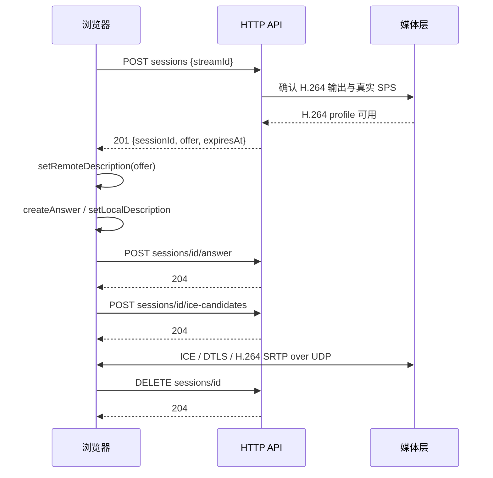

# 🔌 接口与 SDK 接入

上一篇：[02-架构与实现.md](02-架构与实现.md)<br />
下一篇：[04-源码开发与构建包.md](04-源码开发与构建包.md)

本页描述 `WithRtsp` 注册的服务接口，以及在自定义 .NET 宿主中接入 SDK 的方法。未调用该扩展时，核心 SDK 只提供拉流与订阅能力，不会自动开启下面的媒体服务。

## 🌐 地址与认证

默认 HTTP 为 `http://127.0.0.1:5080`，RTSP 为 `rtsp://127.0.0.1:8554/live/{streamId}`。Docker 使用部署时选择的 LAN IP。浏览器页面在 5081；Docker 的 `/api` 同源代理会附加 Token，直接调用 5080 时需要调用者提供 Token。

配置 `BearerToken` 后，**全部 HTTP API**（包括健康检查和 RTSP 设置）都要求 `Authorization: Bearer <Token>`，未配置 Token 的回环宿主可匿名访问。JSON 请求使用 `Content-Type: application/json`。JSON 字段使用 camelCase；业务错误通常为 `{ "error": "错误说明" }`，ASP.NET 请求格式错误也可能返回 Problem Details，401 可以没有 JSON 正文。

下列 Bash 示例针对 5080 直连。`TOKEN` 代表调用者受控持有的真实 Token，不要从部署目录打印秘密到工单或共享日志；将地址替换成实际服务器。

```bash
API_BASE=http://192.168.1.10:5080
curl -H "Authorization: Bearer $TOKEN" "$API_BASE/api/cameras"
```

### 接口速查

| 方法 | 路径 | 成功状态 / 用途 |
| --- | --- | --- |
| GET | `/api/cameras` | 200，已配置流列表及状态，不是所有米家设备列表 |
| GET | `/api/cameras/{streamId}/snapshot` | 200，`image/jpeg`，最近缓存截图 |
| POST | `/api/webrtc/sessions` | 201，创建会话并返回 offer |
| POST | `/api/webrtc/sessions/{id}/answer` | 204，提交 SDP answer |
| POST | `/api/webrtc/sessions/{id}/ice-candidates` | 204，提交浏览器 ICE 候选 |
| DELETE | `/api/webrtc/sessions/{id}` | 204，释放会话 |
| GET | `/api/rtsp/setup` | 200，RTSP 配置与监听状态 |
| POST | `/api/rtsp/setup` | 201，首次保存凭据并开始监听 |
| GET | `/api/health/live` | 200，`{ "live": true }` |
| GET | `/api/health/ready` | 200 就绪，503 未就绪；两者均返回状态 JSON |

## 📷 摄像头列表与截图

列表返回数组。下例只展示响应结构，设备、状态和时间需以真实返回为准：

```json
[
  {
    "streamId": "living-room",
    "cameraId": "CAMERA_DID_A",
    "channel": 0,
    "sourceCodec": "H265",
    "state": "Streaming",
    "lastReceivedAt": "2026-10-05T00:00:00Z",
    "rtspUrl": "rtsp://192.168.1.10:8554/live/living-room",
    "snapshotAvailable": true,
    "webRtcAvailable": true
  }
]
```

`cameraId` 对应配置的 `CameraDeviceId`。`lastReceivedAt` 在未收帧时可以为 `null`；状态枚举包含 `Stopped`、`Authenticating`、`Connecting`、`WaitingForKeyFrame`、`Streaming`、`Reconnecting`、`Faulted`。`snapshotAvailable` 表示已有缓存，`webRtcAvailable` 表示输出能力，均不能证明浏览器已经播放。列表生成的 RTSP URL 使用监听地址；若监听 `0.0.0.0`，客户端应将主机部分替换为服务器 IP。

```bash
curl -f -H "Authorization: Bearer $TOKEN" \
  "$API_BASE/api/cameras/living-room/snapshot" -o living-room.jpg
```

截图带 `Last-Modified`，返回最近已生成的关键帧 JPEG；不保证请求时刻抓拍。流不存在返回 404，截图关闭、原生解码/MJPEG 能力缺失或尚无截图返回 503。

## 📺 WebRTC 信令



### 创建与应答

创建请求体：

```json
{ "streamId": "living-room" }
```

201 响应结构如下，示意 SDP 不能直接用于实际协商：

```json
{
  "sessionId": "SERVER_GENERATED_SESSION_ID",
  "offer": { "type": "offer", "sdp": "ACTUAL_SDP_FROM_SERVER" },
  "expiresAt": "2026-10-05T00:00:30Z"
}
```

浏览器以返回的 offer 设置 remote description，生成并设置本地 answer，再向对应会话提交：

```json
{ "type": "answer", "sdp": "ACTUAL_SDP_FROM_BROWSER" }
```

`expiresAt` 是尚未连接会话的期限，不是已连接视频的固定结束时间。收到 answer 但没有建立连接的会话仍会过期。创建可能因流不存在返回 404、每流 peer 上限返回 429、禁用或媒体/SPS/UDP 不可用返回 503；非法或不兼容 answer 返回 400，未知会话返回 404。

### ICE 候选与清理

候选字段如下，实际 `candidate` 由浏览器 `RTCIceCandidate.toJSON()` 产生：

```json
{
  "candidate": "ACTUAL_NON_EMPTY_BROWSER_ICE_CANDIDATE",
  "sdpMid": "0",
  "sdpMLineIndex": 0,
  "usernameFragment": null
}
```

后三个字段可为 `null`，省略行索引时服务端采用 0。跳过浏览器 `onicecandidate` 中的结束标记（`null`/空 candidate），接口拒绝空候选。客户端应先提交 answer，再发送已缓存的本地候选，避免请求乱序影响协商。服务端候选在 offer SDP 内，没有独立获取候选接口。

停止预览、offer 无效或协商失败后主动 `DELETE` 会话；204 表示已释放，404 表示已经不存在。删除不是幂等的 204 接口，客户端可将清理阶段的 404 视为完成。网络中断可能导致无法立即清理，服务端还会按会话超时回收。

## 🔐 RTSP 初始化与播放

`GET /api/rtsp/setup` 返回 `configured`、`listening`、`username`，未配置时用户名为 `null`，不返回密码。网页凭据模式下首次提交：

```json
{ "username": "viewer", "password": "REPLACE_WITH_YOUR_RTSP_PASSWORD" }
```

服务端不接收确认密码字段。用户名与密码约束见 [配置参考](00-配置文件参考.md)；非法输入为 400，已初始化为 409，目录权限/文件保存/端口错误为 503。成功 201 返回相同状态结构，并立即监听。静态配置模式已经处于 configured 状态，不使用该接口改密。

在播放器打开 `rtsp://服务器IP:8554/live/living-room`，使用 **TCP** 传输，在认证界面输入凭据。UDP SETUP 返回 461 Unsupported Transport。URL 中的流名称必须与配置一致；RTSP 是原编码输出，H.265 摄像头需客户端支持 H.265 解码。优先使用认证界面，避免将密码嵌入 URL 或复制到日志。

## 🩺 健康接口

`live` 仅表示 HTTP 服务能响应。`ready` 返回下面结构，示例为媒体可用、等待网页设置：

```json
{
  "ready": false,
  "mediaAvailable": true,
  "streams": [
    {
      "streamId": "living-room",
      "state": "Streaming",
      "lastReceivedAt": "2026-10-05T00:00:00Z",
      "receiving": true,
      "snapshotAvailable": true,
      "webRtcAvailable": true
    }
  ],
  "mediaReady": true,
  "rtspConfigured": false,
  "rtspListening": false
}
```

- `mediaAvailable`：完整 FFmpeg 原生库、H.264/HEVC 解码器、MJPEG 和配置的 H.264 编码器都可用，即使某项输出关闭也检查完整能力。
- `receiving`：流处于 Streaming，最近收帧未超过 `IdleTimeout`。
- 就绪响应的 `snapshotAvailable`：存在截图，且年龄未超过 `FirstKeyFrameTimeout`；比摄像头列表的缓存存在检查更严格。
- `mediaReady`：至少一条流、完整媒体能力、每条流近期收帧，并满足已开启的截图/WebRTC 条件。
- `ready`：`mediaReady && rtspConfigured && rtspListening`；不满足时返回 503。

这些接口没有验证远端浏览器解码、流畅度或整夜稳定性；部署验收还需真实画面。

## 🧑‍💻 最小 SDK 宿主

在自己的 `net8.0` 控制台宿主中添加仓库项目引用：`src/MiCamera.Net`、`src/rtsp/MiCamera.Net.RTSP` 及其传递依赖。不要假设已有可安装的公开 NuGet 版本。下面的 C# 示例使用 Windows 路径和回环监听，替换上游地址、密码 MD5、DID、证书及动态库目录后运行：

```csharp
using MiCamera.Net;
using MiCamera.Net.Abstractions.Common.Enums;
using MiCamera.Net.Abstractions.ConfigSettings;
using MiCamera.Net.RTSP.Extensions;
using Microsoft.Extensions.Hosting;

MiCameraServerOptions core = new()
{
    Miloco = new()
    {
        BaseUrl = "https://192.168.1.10:8000",
        Username = "admin",
        Password = "REPLACE_WITH_LOCAL_PASSWORD_MD5",
        TrustedServerCertificatePath = @"C:\secure-config\miloco-cert.pem"
    },
    Streams =
    [
        new()
        {
            StreamId = "living-room",
            CameraDeviceId = "REPLACE_WITH_CAMERA_DID",
            Channel = 0,
            Codec = VideoCodec.H265,
            NominalFrameRate = 25
        }
    ]
};

using IHost host = MiCameraEngineFactory.CreateServerBuilder()
    .Initialize(core)
    .WithRtsp(options =>
    {
        options.Http.AllowedOrigins = ["http://127.0.0.1:5081"];
        options.Media.NativeLibraryPath = @"C:\ffmpeg\bin";
        options.Media.H264MaxWidth = 1920;
        options.Media.H264MaxHeight = 1080;
    })
    .Build();

await host.RunAsync();
```

核心选项中的 `Streams` 与 JSON 的 `MediaServer.Rtsp.Streams` 是同一组配置的不同表达方式；C# 地址/库目录仍使用 `Http.ListenUrl`、`Media.NativeLibraryPath`。`Initialize`、`WithRtsp`、`Build` 分别只调用一次，并按上述顺序组织。

如果只需要原始流，省略 `WithRtsp`，在宿主服务中注入 `ICameraStreamProvider`，通过 `SubscribeAsync(streamId, cancellationToken)` 获取编码块，通过 `TryGetSnapshot` 获取流状态。这里的核心 snapshot 是状态快照，不是 JPEG；JPEG 契约是 `IVideoSnapshotProvider`。所有运行秘密应来自应用自己的受控配置，不提交到示例代码。

---

上一篇：[02-架构与实现.md](02-架构与实现.md)<br />
下一篇：[04-源码开发与构建包.md](04-源码开发与构建包.md)
