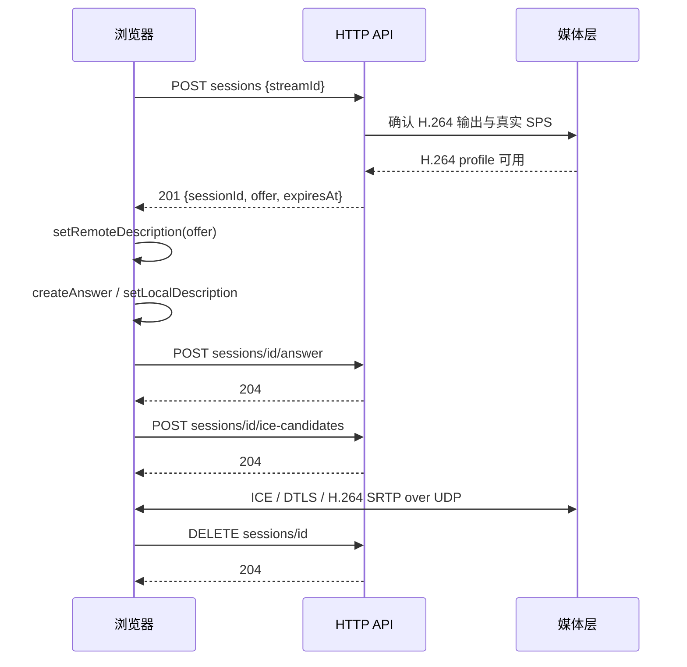

# 🔌 接口与 SDK 接入

上一篇：[02-架构与实现.md](02-架构与实现.md)<br />
下一篇：[04-源码开发与构建包.md](04-源码开发与构建包.md)

本页描述 Sample 宿主提供的 HTTP / RTSP 接口，以及在自定义 .NET 宿主中接入 SDK 的方法。`WithRtsp` 注册媒体、HTTP API 和 RTSP 服务；网页初始化与配置接口还需要 `WithWebSetup` 注册配置服务与 SQLite 存储，Sample 已默认启用。

仅使用核心 SDK 时，可以只拉流和订阅，不必启用 HTTP、RTSP 或网页配置。

## 🌐 地址与认证

默认 HTTP 为 `http://127.0.0.1:5080`，RTSP 为 `rtsp://127.0.0.1:8554/live/{streamId}`。Docker 使用部署时选择的 LAN IP。浏览器页面在 5081；Docker 的 `/api` 同源代理会附加 Token，直接调用 5080 时需要调用者提供 Token。

配置 HTTP Bearer Token 后，**全部控制器 API**（包括健康检查、初始化和重新配置）都要求 `Authorization: Bearer <Token>`，未配置 Token 的回环宿主可匿名访问。Docker 的 Token 来自部署 secret，不通过网页设置。JSON 请求使用 `Content-Type: application/json`，字段使用 camelCase，编码枚举为 `H264` / `H265` 字符串。

业务错误通常为 `{ "error": "错误说明" }`，ASP.NET 请求格式错误也可能返回 Problem Details，401 可以没有 JSON 正文。

下列 Bash 示例针对 5080 直连。`TOKEN` 代表调用者受控持有的真实 Token，不要从部署目录打印秘密到工单或共享日志；将地址替换成实际服务器。

```bash
API_BASE=http://192.168.1.10:5080
curl -H "Authorization: Bearer $TOKEN" "$API_BASE/api/cameras"
```

### 接口速查

| 方法 | 路径 | 成功状态 / 用途 |
| --- | --- | --- |
| GET | `/api/cameras` | 200，已配置流列表及状态，不是所有米家设备列表 |
| GET | `/api/cameras/{streamId}/snapshot` | 200，`image/jpeg`，最近缓存截图 |
| POST | `/api/webrtc/sessions` | 201，创建会话并返回 offer |
| POST | `/api/webrtc/sessions/{id}/answer` | 204，提交 SDP answer |
| POST | `/api/webrtc/sessions/{id}/ice-candidates` | 204，提交浏览器 ICE 候选 |
| DELETE | `/api/webrtc/sessions/{id}` | 204，释放会话 |
| GET | `/api/setup` | 200，初始化、监听、版本与待应用状态 |
| GET | `/api/settings` | 200，已保存的非秘密配置 |
| POST | `/api/setup/discover` | 200，使用候选 Miloco 连接发现摄像头 |
| PUT | `/api/settings` | 200，保存整组配置并即时应用 |
| POST | `/api/setup/activate` | 200，重试应用已保存的配置 |
| GET | `/api/health/live` | 200，`{ "live": true }` |
| GET | `/api/health/ready` | 200 就绪，503 未就绪；两者均返回状态 JSON |

Swagger UI 位于 `/swagger/`，OpenAPI JSON 位于 `/swagger/v1/swagger.json`。Docker 可从 `http://服务器IP:5081/swagger/` 打开；直连 `5080` 调用受保护 API 时仍需提供 Token。

## ⚙️ 网页初始化与重新配置接口

当前流程为：读取状态与配置 → 验证 Miloco 连接并发现设备 → 保存摄像头和 RTSP 配置 → 检查应用状态。旧的 `/api/rtsp/setup` 已移除，RTSP 凭据不再单独保存到 JSON 文件。

### 读取状态与配置

`GET /api/setup` 在首次未配置时返回：

```json
{
  "configured": false,
  "listening": false,
  "username": null,
  "version": 0,
  "applyPending": false
}
```

- `configured`：SQLite 中已有完整的用户配置。
- `listening`：RTSP 已启用且未暂停，不表示摄像头一定收到视频。
- `username`：当前 RTSP 用户名，未配置时为 `null`。
- `version`：已保存的配置版本；首次保存前为 `0`。
- `applyPending`：已保存版本尚未成功应用到运行时。

`GET /api/settings` 返回可编辑配置，下面是已配置后的结构示例：

```json
{
  "version": 1,
  "milocoBaseUrl": "https://192.168.1.10:8000",
  "hasMilocoPin": true,
  "rtspUsername": "viewer",
  "hasRtspPassword": true,
  "streams": [
    {
      "streamId": "living-room",
      "cameraDeviceId": "CAMERA_DID_A",
      "channel": 0,
      "codec": "H265",
      "nominalFrameRate": 25
    }
  ]
}
```

未配置时 `version` 为 `0`、地址与用户名为空、两个凭据标志为 false、`streams` 为空数组。接口不返回 PIN、RTSP 密码或认证摘要。注意查询字段为 `milocoBaseUrl`，发现和保存请求使用 `baseUrl`。

### 发现 Miloco 摄像头

向 `POST /api/setup/discover` 提交候选连接，PIN 使用实际的六位数字：

```json
{ "baseUrl": "https://192.168.1.10:8000", "pin": "123456" }
```

成功返回 Miloco 设备数组，字段为 `did`、`name`、可空的 `roomName`、`online` 和可空的 `channelCount`。它与 `/api/cameras` 返回的已配置流列表不同。

该操作验证本地登录与小米账号授权，但不保存配置，也不切换正在播放的连接。已有配置时，省略或留空 `pin` 可保留已存认证信息；首次必须填写。`baseUrl` 必须是完整 HTTP/HTTPS 地址，不能包含账号、查询参数或 URL 片段。Docker 部署使用已挂载证书对应的 Miloco 服务。

### 保存并应用配置

向 `PUT /api/settings` 提交完整配置。下面示例为首次保存，DID、地址、PIN 和密码都需要替换为实际值：

```json
{
  "version": 0,
  "baseUrl": "https://192.168.1.10:8000",
  "pin": "123456",
  "rtspUsername": "viewer",
  "rtspPassword": "REPLACE_WITH_YOUR_RTSP_PASSWORD",
  "streams": [
    {
      "streamId": "living-room",
      "cameraDeviceId": "CAMERA_DID_A",
      "channel": 0,
      "codec": "H265",
      "nominalFrameRate": 25
    }
  ]
}
```

| 字段 | 约束 |
| --- | --- |
| `version` | 使用最近一次 `GET /api/settings` 的版本；成功保存后递增，不自行猜测 |
| `baseUrl` / `pin` | `baseUrl` 必填；`pin` 为六位数字，已有 PIN 时仅 `pin` 可留空保留；用户固定为 `admin` |
| `rtspUsername` | 1–64 位英文字母、数字、点、下划线或连字符 |
| `rtspPassword` | 首次设置或修改用户名时必填；1–256 个字符，不能纯空白或包含控制字符；已有密码且用户名未变时可留空保留 |
| `streams` | 至少一路；保存会替换整组流列表，不是追加操作 |
| `streamId` | 1–64 位英文字母、数字、连字符或下划线，首位为字母或数字；忽略大小写后唯一 |
| `cameraDeviceId` / `channel` | DID 必须在当前 Miloco 列表中；通道 ≥ 0，有已知通道数时不能越界；设备与通道组合不能重复 |
| `codec` / `nominalFrameRate` | `H264` 或 `H265`，须与上游一致；回退帧率为 1–120，不改变实际摄像头帧率 |

服务端不接收确认密码字段，网页负责比较两次输入。保存前再次验证 Miloco 和设备，必要时预留 RTSP 端口，然后在 SQLite 事务中保存，关闭已有播放连接并即时应用。200 返回新的 `SetupStatus`；初次成功保存后通常为 `configured: true`、`listening: true`、`version: 1`、`applyPending: false`。媒体收帧和完整就绪仍需另行检查。

### 错误与重试

| 状态码 | 含义与处理 |
| --- | --- |
| 400 | 参数、凭据格式、流名称、设备或通道无效；修改请求后重试 |
| 401 | HTTP API Token 缺失或错误，与 Miloco PIN / RTSP 密码无关 |
| 409 | 配置已被其他页面修改；重新读取配置和版本再编辑 |
| 502 | Miloco 连接、认证、授权或响应协议失败；检查上游服务后重试 |
| 503 | 数据目录、数据库、磁盘、RTSP 端口或运行时应用失败；先核对保存状态 |

收到 503 时，配置可能已经提交，不应直接重复首次保存。先读取 `/api/setup` 和 `/api/settings`；若配置已保存但 `applyPending` 为 true 或 `listening` 为 false，调用 `POST /api/setup/activate`，无请求体。成功返回 200 和状态对象；没有已保存配置时返回 400。网页的“重试应用已保存的配置”使用此接口。

## 📷 摄像头列表与截图

列表返回数组。下例只展示响应结构，设备、状态和时间需以真实返回为准：

```json
[
  {
    "streamId": "living-room",
    "cameraId": "CAMERA_DID_A",
    "channel": 0,
    "sourceCodec": "H265",
    "state": "Streaming",
    "lastReceivedAt": "2026-10-05T00:00:00Z",
    "rtspUrl": "rtsp://192.168.1.10:8554/live/living-room",
    "snapshotAvailable": true,
    "webRtcAvailable": true
  }
]
```

`cameraId` 对应运行时的 `CameraDeviceId`，与设置接口的 `cameraDeviceId` 表达同一设备。首次网页配置前列表为空。`lastReceivedAt` 在未收帧时可以为 `null`；状态枚举包含 `Stopped`、`Authenticating`、`Connecting`、`WaitingForKeyFrame`、`Streaming`、`Reconnecting`、`Faulted`。`snapshotAvailable` 表示已有缓存，`webRtcAvailable` 表示输出能力，均不能证明浏览器已经播放。列表生成的 RTSP URL 使用监听地址；若监听 `0.0.0.0`，客户端应将主机部分替换为服务器 IP。

```bash
curl -f -H "Authorization: Bearer $TOKEN" \
  "$API_BASE/api/cameras/living-room/snapshot" -o living-room.jpg
```

截图带 `Last-Modified`，返回最近已生成的关键帧 JPEG；不保证请求时刻抓拍。流不存在返回 404，截图关闭、原生解码/MJPEG 能力缺失或尚无截图返回 503。

## 📺 WebRTC 信令



### 创建与应答

创建请求体：

```json
{ "streamId": "living-room" }
```

201 响应结构如下，示意 SDP 不能直接用于实际协商：

```json
{
  "sessionId": "SERVER_GENERATED_SESSION_ID",
  "offer": { "type": "offer", "sdp": "ACTUAL_SDP_FROM_SERVER" },
  "expiresAt": "2026-10-05T00:00:30Z"
}
```

浏览器以返回的 offer 设置 remote description，生成并设置本地 answer，再向对应会话提交：

```json
{ "type": "answer", "sdp": "ACTUAL_SDP_FROM_BROWSER" }
```

`expiresAt` 是尚未连接会话的期限，不是已连接视频的固定结束时间。收到 answer 但没有建立连接的会话仍会过期。创建可能因流不存在返回 404、每流 peer 上限返回 429、禁用或媒体/SPS/UDP 不可用返回 503；非法或不兼容 answer 返回 400，未知会话返回 404。

### ICE 候选与清理

候选字段如下，实际 `candidate` 由浏览器 `RTCIceCandidate.toJSON()` 产生：

```json
{
  "candidate": "ACTUAL_NON_EMPTY_BROWSER_ICE_CANDIDATE",
  "sdpMid": "0",
  "sdpMLineIndex": 0,
  "usernameFragment": null
}
```

后三个字段可为 `null`，省略行索引时服务端采用 0。跳过浏览器 `onicecandidate` 中的结束标记（`null`/空 candidate），接口拒绝空候选。客户端应先提交 answer，再发送已缓存的本地候选，避免请求乱序影响协商。服务端候选在 offer SDP 内，没有独立获取候选接口。

停止预览、offer 无效或协商失败后主动 `DELETE` 会话；204 表示已释放，404 表示已经不存在。删除不是幂等的 204 接口，客户端可将清理阶段的 404 视为完成。网络中断可能导致无法立即清理，服务端还会按会话超时回收。

## 🔐 RTSP 播放

Sample 在整组网页配置成功保存并应用后启用 RTSP；用户名和密码可以通过“重新配置”修改。查询监听与配置状态使用 `/api/setup`，不返回密码。

在播放器打开 `rtsp://服务器IP:8554/live/living-room`，使用 **TCP** 传输，在认证界面输入凭据。UDP SETUP 返回 461 Unsupported Transport。URL 中的流名称必须与配置一致；RTSP 是原编码输出，H.265 摄像头需客户端支持 H.265 解码。优先使用认证界面，避免将密码嵌入 URL 或复制到日志。

## 🩺 健康接口

`live` 仅表示 HTTP 服务能响应。`ready` 返回下面结构，示例为原生媒体能力可用、等待首次网页配置：

```json
{
  "ready": false,
  "mediaAvailable": true,
  "streams": [],
  "mediaReady": false,
  "rtspConfigured": false,
  "rtspListening": false
}
```

- `mediaAvailable`：完整 FFmpeg 原生库、H.264/HEVC 解码器、MJPEG 和配置的 H.264 编码器都可用，即使某项输出关闭也检查完整能力。
- `streams`：每条已配置流的 `streamId`、`state`、可空的 `lastReceivedAt`、`receiving`、`snapshotAvailable` 和 `webRtcAvailable`；首次配置前为空。
- `receiving`：流处于 Streaming，最近收帧未超过 `IdleTimeout`。
- 就绪响应的 `snapshotAvailable`：存在截图，且年龄未超过 `FirstKeyFrameTimeout`；比摄像头列表的缓存存在检查更严格。
- `mediaReady`：至少一条流、完整媒体能力、每条流近期收帧，并满足已开启的截图/WebRTC 条件。
- `ready`：`mediaReady && rtspConfigured && rtspListening`；不满足时返回 503。

这些接口没有验证远端浏览器解码、流畅度或整夜稳定性；部署验收还需真实画面。

## 🧑‍💻 SDK 接入

在自己的 `net8.0` 控制台宿主中添加仓库项目引用：`src/MiCamera.Net`、`src/rtsp/MiCamera.Net.RTSP` 及其传递依赖。不要假设已有可安装的公开 NuGet 版本。以下示例使用 Windows 路径和回环监听；路径、上游参数和运行秘密按自己的环境准备。

### 方式一：网页管理的宿主

与 Sample 一样，在 `Initialize` 前启用核心的网页管理，在 `WithRtsp` 中启用 RTSP 网页管理，再调用 `WithWebSetup`：

```csharp
using MiCamera.Net;
using MiCamera.Net.Abstractions.ConfigSettings;
using MiCamera.Net.RTSP.Extensions;
using Microsoft.Extensions.Hosting;

MiCameraServerOptions core = new()
{
    Miloco = new()
    {
        TrustedServerCertificatePath = @"C:\secure-config\miloco-cert.pem"
    }
};
core.Initialization.WebManaged = true;

using IHost host = MiCameraEngineFactory.CreateServerBuilder()
    .Initialize(core)
    .WithRtsp(options =>
    {
        options.Rtsp.WebManaged = true;
        options.Http.AllowedOrigins = ["http://127.0.0.1:5081"];
        options.Media.FFmpegLibPath = @"C:\ffmpeg\bin";
    })
    .WithWebSetup(@"C:\secure-config\micamera-state")
    .Build();

await host.RunAsync();
```

首次启动后，通过前端或上述配置 API 设置 Miloco、摄像头和 RTSP 凭据；以后从指定目录的 `settings.db` 恢复。省略 `WithWebSetup` 的目录参数时，优先使用 `MICAMERA_DATA_DIRECTORY`，否则使用 `LocalApplicationData/MiCamera.Net`。

### 方式二：应用代码提供配置

核心 SDK 仍支持应用直接提供 `Miloco` 和 `Streams`。下面是静态配置宿主，替换密码 MD5、真实 DID、地址及路径后运行：

```csharp
using MiCamera.Net;
using MiCamera.Net.Abstractions.Common.Enums;
using MiCamera.Net.Abstractions.ConfigSettings;
using MiCamera.Net.RTSP.Extensions;
using Microsoft.Extensions.Hosting;

MiCameraServerOptions core = new()
{
    Miloco = new()
    {
        BaseUrl = "https://192.168.1.10:8000",
        Username = "admin",
        Password = "REPLACE_WITH_LOCAL_PASSWORD_MD5",
        TrustedServerCertificatePath = @"C:\secure-config\miloco-cert.pem"
    },
    Streams =
    [
        new()
        {
            StreamId = "living-room",
            CameraDeviceId = "REPLACE_WITH_CAMERA_DID",
            Channel = 0,
            Codec = VideoCodec.H265,
            NominalFrameRate = 25
        }
    ]
};

using IHost host = MiCameraEngineFactory.CreateServerBuilder()
    .Initialize(core)
    .WithRtsp(options =>
    {
        options.Http.AllowedOrigins = ["http://127.0.0.1:5081"];
        options.Rtsp.Username = "viewer";
        options.Rtsp.Password = "REPLACE_WITH_YOUR_RTSP_PASSWORD";
        options.Media.FFmpegLibPath = @"C:\ffmpeg\bin";
        options.Media.H264MaxWidth = 1920;
        options.Media.H264MaxHeight = 1080;
    })
    .Build();

await host.RunAsync();
```

这里的 `MiCameraServerOptions.Streams` 是 SDK 的代码配置，不表示 Sample JSON 仍支持 `MediaServer.Rtsp.Streams`。Sample 会从 SQLite 加载用户配置，手工向其 JSON 添加旧字段不会替代网页配置。

C# 地址 / 库目录使用 `Http.ListenUrl`、`Media.FFmpegLibPath`，与 Sample JSON 的字段映射不同。非回环 HTTP 必须提供 `Http.BearerToken`；静态非回环 RTSP 必须提供用户名和密码。`Initialize`、`WithRtsp`、`Build` 分别只调用一次；网页模式还需在 `Build` 前调用 `WithWebSetup`。静态模式不使用网页配置接口。

如果只需要原始流，省略 `WithRtsp`，在宿主服务中注入 `ICameraStreamProvider`，通过 `SubscribeAsync(streamId, cancellationToken)` 获取编码块，通过 `TryGetSnapshot` 获取流状态。这里的核心 snapshot 是状态快照，不是 JPEG；JPEG 契约是 `IVideoSnapshotProvider`。所有运行秘密应来自应用自己的受控配置，不提交到示例代码。

---

上一篇：[02-架构与实现.md](02-架构与实现.md)<br />
下一篇：[04-源码开发与构建包.md](04-源码开发与构建包.md)
