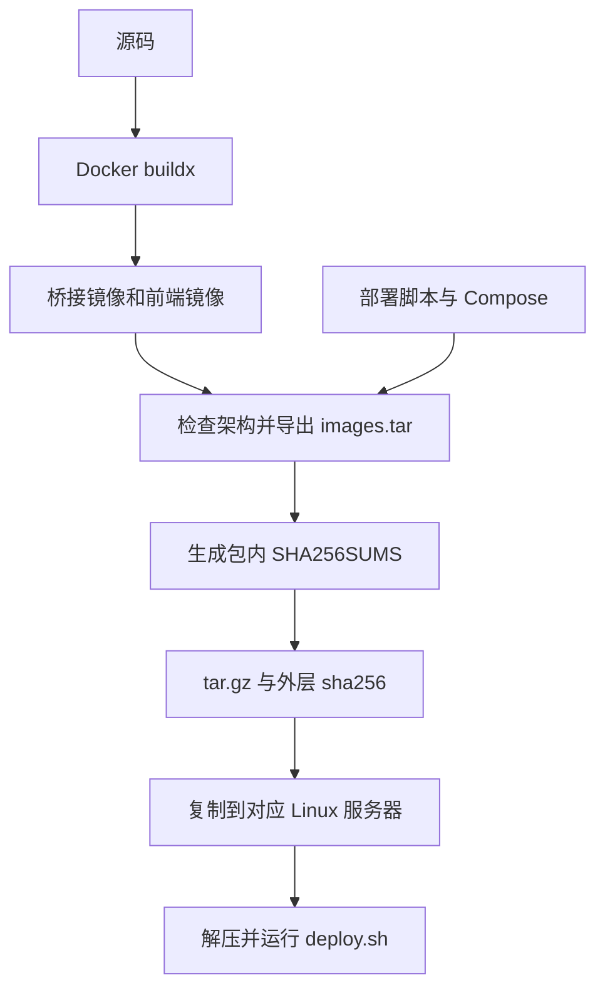

# 🛠️ 源码开发与构建包

上一篇：[03-接口与SDK接入.md](03-接口与SDK接入.md)<br />
下一篇：[05-故障排查.md](05-故障排查.md)

本页面向源码开发、构建镜像与生成可分发部署包。下载 GitHub Release 包、服务器部署和网页初始化的完整步骤见 [桥接服务部署](01-桥接服务部署.md)；构建机器与运行服务器可以是两台不同的机器。

## 🧰 环境与用途

| 工作 | 所需工具 | 说明 |
| --- | --- | --- |
| 后端源码编译、调试 | 支持 `net8.0` 的 .NET SDK | 项目目标为 .NET 8；截图与 H.265 转码另需 FFmpeg 7.1 兼容原生库 |
| 前端开发 | Node.js 与 npm | `package.json` 当前约束：`^22.22.2 || ^24.15.0 || >=26.0.0` |
| 生成完整部署包 | Python 3.13.2（推荐使用版本）、Docker Engine/Desktop、Docker buildx | .NET、Node.js 和媒体依赖在镜像构建阶段提供，不必安装到构建主机 |
| 跨架构构建 | 上述工具及目标平台执行能力 | `--arch all` 需要同时能执行 amd64/arm64 镜像阶段，可由已配置的 QEMU/binfmt 或原生节点提供 |
| Linux 服务器运行包 | 原生 Linux、rootful Docker、Compose v2.20+、Bash 4+、iproute2、awk、coreutils、util-linux | 无需主机 Python、Node.js 或 .NET；首次拉取 Miloco、账号授权仍需联网 |

Docker Desktop 可用于构建与隔离检查，部署向导不支持在 Desktop/WSL 网络上直接套用原生 Linux 的 LAN 绑定方式。运行限制见 [部署环境](01-桥接服务部署.md)。

## 📦 从源码生成完整部署包

在仓库根目录执行。版本标识使用字母、数字、点、下划线或连字符；首字符为字母或数字，总长不超过 81。

```bash
git clone https://github.com/mm7h/MiCamera.Net.git
cd MiCamera.Net
python3 --version
docker buildx version
python3 deployment/build-package.py local-build --arch amd64
```

Windows PowerShell 将命令中的 `python3` 改为已安装的 `python`；启用 Docker Desktop 的 Linux 容器引擎。构建过程中需要访问基础镜像仓库、NuGet、npm 和 Debian 软件源。

已有源码时直接在仓库根目录构建，当前工作区的源码修改也会参与打包；需要可复现的版本时，先检出对应提交或标签。部署脚本需要 LF 换行，Windows 获取或修改源码时应检查 `deploy.sh` 的行尾格式。

| 目标服务器 | 参数 | 输出 |
| --- | --- | --- |
| Linux x86-64，例如 Intel/AMD 主机 | `--arch amd64` | `micamera-net-local-build-linux-amd64.tar.gz` |
| Linux ARM64，例如支持 64 位 Linux 的 ARM 主机 | `--arch arm64` | `micamera-net-local-build-linux-arm64.tar.gz` |
| 同时制作两种包 | `--arch all` | 两份架构独立的归档；需要跨架构执行能力 |

省略 `--arch` 时默认 `all`，因此首次构建建议明确选择服务器架构。生成两种完整包的命令：

```bash
python3 deployment/build-package.py local-build --arch all
```



### 产物与包内容

输出目录为 `deployment/build_output/`，已被 Git 忽略。每份 `tar.gz` 都有同名 `.tar.gz.sha256` 文件。

```text
micamera-net-local-build-linux-amd64/
├── README.md                      脚本生成的包内简要说明
├── LICENSE
├── deploy.sh
├── docker-compose.yml             已去掉源码 build 定义
├── images.tar                     桥接与前端镜像
├── SHA256SUMS                     包内文件校验
└── deployment/
    ├── package.env                版本、架构、镜像标签与 ID
    ├── miloco-entrypoint.py
    └── THIRD-PARTY-NOTICES.md
```

包不包含源码、开发依赖、用户配置或 `.deploy`；**也不包含 Miloco 镜像**。桥接镜像提供 .NET 8 自包含应用、Python 入口、SQLite 依赖和 FFmpeg 原生媒体库。正式镜像不携带仓库示例 JSON，部署时通过只读挂载提供基础配置。

包内 README 由打包脚本生成，与仓库根 README 是两个文件。当前的 Miloco 连接、摄像头选择与 RTSP 凭据由网页统一管理，操作流程以 [首次初始化说明](01-桥接服务部署.md) 为准。

在 Linux 上校验外层归档，再解压；文件名中的版本与架构按实际产物替换：

```bash
sha256sum -c micamera-net-local-build-linux-amd64.tar.gz.sha256
tar -xzf micamera-net-local-build-linux-amd64.tar.gz
cd micamera-net-local-build-linux-amd64
sha256sum -c SHA256SUMS
bash deploy.sh
```

向导还会检查包内校验、主机架构、镜像标签与 ID，再导入镜像。完整运行步骤见 [桥接服务部署](01-桥接服务部署.md)。

### 复用镜像与构建参数

仅在对应版本与架构的镜像已经构建成功时使用：

```bash
python3 deployment/build-package.py local-build --arch amd64 --reuse-images
```

需存在 `micamera-net-bridge:local-build-amd64` 与 `micamera-net-web:local-build-amd64`；脚本检查架构，不会自动把其他标签当作这两个镜像。

构建源由 Dockerfile 的参数决定。可重复传入 `--build-arg NAME=VALUE`，名称包括桥接的 `DOTNET_SDK_IMAGE`、`RUNTIME_IMAGE`、`NUGET_SOURCE`，前端的 `NODE_IMAGE`、`NGINX_IMAGE`、`NPM_REGISTRY`。替换基础镜像前核对目标架构、Node 版本和 FFmpeg 7.1 兼容原生库；不要将依赖许可或兼容性视为自动成立。

### 构建与部署入口的区别

| 命令与位置 | 实际用途 |
| --- | --- |
| 源码目录中 `python3 deployment/build-package.py ...` | 构建、导出镜像，生成可分发的完整部署归档 |
| 源码目录中 `bash deploy.sh` | 在受支持的 Linux 服务器本地构建镜像并部署，不生成 tar.gz 包 |
| 源码目录中 `bash deploy.sh build` | 通过向导做地址与状态准备、构建本地镜像，不启动服务，不生成完整包 |
| 解压包中 `bash deploy.sh` | 校验、导入已有镜像并部署，跳过源码构建 |

## 💻 本地后端开发

Sample 服务器与 Docker 部署使用同一套网页配置服务。本地开发也先启动 HTTP 服务，再在前端填写 Miloco BaseUrl、六位 PIN、摄像头与 RTSP 凭据；无需向 JSON 写入密码 MD5、DID 或 `Streams`。

先准备可访问的 Miloco，并在其页面完成小米账号绑定。参考 [配置文件说明](00-配置文件参考.md) 准备基础 JSON，建议从 `demo/MiCamera.Net.Sample.Server/Configs/MiCameraConfig.json` 复制到仓库之外，再按本机环境调整：

| 参数 | 本地开发设置 |
| --- | --- |
| `MediaServer.ListenAddress` | 例如 `http://127.0.0.1:5080`，与前端 API 地址一致 |
| `MediaServer.AllowedOrigins` | 包含实际前端源，例如 `http://127.0.0.1:5081`；`localhost` 与 `127.0.0.1` 是不同的源 |
| `MediaServer.FFmpeg.Path` | FFmpeg 7.1 兼容动态库目录，例如 Windows 的 `C:\ffmpeg\bin`；不是 `ffmpeg.exe` 路径 |
| `Miloco` TLS 配置 | 使用实际 PEM 的 `TrustedServerCertificatePath` 并保持 `AllowInvalidServerCertificate: false`；示例的跳过校验仅用于受控本地调试 |

`Streaming`、`Reconnect` 和其他媒体参数通常可保留默认值。Sample 会忽略旧文件中的用户连接与凭据字段，并从 SQLite 恢复配置；旧的顶层媒体段和 `Streams` 会明确报错。

### 指定本地状态目录

基础 JSON 与用户配置数据库是两份独立数据。Sample 通过 `WithWebSetup()` 使用以下目录优先级：

1. `MICAMERA_DATA_DIRECTORY` 环境变量。
2. 未设置时使用当前用户的 `LocalApplicationData/MiCamera.Net`。

数据库名为 `settings.db`，不放在基础 JSON 旁，也不随前端打包。建议给开发实例单独指定目录，避免不同调试实例共享配置；Docker 则使用 `.deploy/micamera-state/`。该目录包含认证摘要和摄像头信息，不提交到仓库，也不要直接编辑数据库。

### Debug：读取默认文件

调试时读取输出目录中的 `Configs/MiCameraConfig.json`，源码同名文件由构建复制到那里。启动参数不会覆盖 Debug 的配置路径；需要指定外置文件时使用后面的 Release 命令。

```powershell
$env:MICAMERA_DATA_DIRECTORY = 'C:\secure-config\micamera-dev-state'
dotnet run --project demo/MiCamera.Net.Sample.Server
```

### Release：读取指定文件（推荐）

将准备好的基础配置保存在仓库之外；使用 `-c Release` 确保指定路径生效。Release 必须传入一个配置文件路径：

```powershell
$env:MICAMERA_DATA_DIRECTORY = 'C:\secure-config\micamera-dev-state'
dotnet run -c Release --project demo/MiCamera.Net.Sample.Server -- C:\secure-config\MiCameraConfig.json
```

Linux 对应命令：

```bash
export MICAMERA_DATA_DIRECTORY="$HOME/.local/share/micamera-dev"
dotnet run -c Release --project demo/MiCamera.Net.Sample.Server -- /opt/micamera-config/MiCameraConfig.json
```

FFmpeg 相对路径相对于应用输出目录，不是终端工作目录；Release 示例同样遵循该规则。JSON 中 Windows 路径的反斜线要转义，例如 `"C:\\ffmpeg\\bin"`。

首次没有 SQLite 配置时，后端正常响应 HTTP，但流列表为空、RTSP 不监听、完整就绪为 false。前端完成整组配置后开始拉流并启用 RTSP，之后重启会恢复已存设置；不需要重新向 JSON 填写设备列表。

## 🌐 本地前端开发

后端保持运行，在另一个终端启动前端：

```powershell
Set-Location demo/MiCamera.Net.Sample.Web
npm.cmd ci
npm.cmd run dev
```

浏览器打开 `http://127.0.0.1:5081`。默认 API 为 `http://127.0.0.1:5080`，可通过前端目录中的未提交 `.env.local` 设置 `VITE_MICAMERA_API_URL`。页面首次进入初始化向导，配置 Miloco → 连接后端 API → 选择摄像头 → 设置 RTSP 凭据；已配置实例可从主页面“重新配置”修改并即时应用。

源码开发模式直连 API，启用 HTTP 认证时在向导的“连接后端 API”步骤填写 Token。API 地址与 Token、截图历史保存在当前页面内存中，刷新会重新读取默认连接；摄像头和认证配置保存在后端 SQLite，不会随刷新消失。切换后端时需重新核对该后端的配置和 Miloco PIN。

局域网开发使用 `npm.cmd run dev:lan`，同时配置后端 LAN 监听地址、`MediaServer.BearerToken`、WebRTC UDP 绑定和 `AllowedOrigins` 中的实际页面源。非回环 HTTP 必须有 Token；Docker 由入口脚本注入，本地自建宿主需要自行提供。Linux/macOS 命令使用 `npm`。

Docker 前端构建固定启用 `VITE_MICAMERA_SAME_ORIGIN_API=true`，浏览器经同源 `/api` 代理访问；这与本地源码开发的直连模式不同。

Swagger 可在后端的 `http://127.0.0.1:5080/swagger/` 查看。保存配置使用 `PUT /api/settings`，设备发现和应用重试等接口见 [接口与 SDK 接入](03-接口与SDK接入.md)。

## 🧪 可选开发验证工具

`deployment/verification/` 保留两个 Python 开发验证脚本，只使用标准库，无需安装 pip 依赖。它们不参与正常构建、部署或运行，也不包含在完整部署包及正式镜像中；模拟环境不能证明真实摄像头播放或长期稳定性。

| 脚本 | 用途 | 运行环境 |
| --- | --- | --- |
| [verify_setup.py](../deployment/verification/verify_setup.py) | 启动真实 .NET 后端与模拟 Miloco，自动检查配置、鉴权、热更新、并发和持久化 | Python 3（推荐 3.13.2）、.NET SDK 及预先构建的 Sample 后端 |
| [ui_setup_fixture.py](../deployment/verification/ui_setup_fixture.py) | 提供纯模拟 API，供浏览器检查配置向导、切换后端及失败交互 | Python 3、按前文启动的 Node.js/Vite 前端；无需 .NET、Miloco 或摄像头 |

### 真实后端配置验证

在仓库根目录执行：

```powershell
dotnet build MiCamera.Net.sln -c Release
python deployment/verification/verify_setup.py
```

Linux/macOS 将 `python` 改为 `python3`。脚本使用随机本地 API/RTSP 端口、临时基础配置和临时 SQLite 数据库，不使用现有用户配置或真实 Miloco；正常结束后停止服务并清理临时数据。全部断言通过时输出“验证通过”，失败时输出后端日志并以非零退出码结束。

检查范围包括 Bearer/Digest 鉴权、设备发现及异常响应、配置校验、端口冲突、版本冲突与并发保存、无进程重启的配置热更新、旧连接清理、SQLite 持久化与重启恢复，以及部署配置初始化和旧文件字段清理。

| 可选参数 | 说明 |
| --- | --- |
| `--debug` | 使用 Debug 后端，须先执行 `dotnet build MiCamera.Net.sln -c Debug`；临时替换输出目录中的 `Configs/MiCameraConfig.json`，退出清理时恢复原文件 |
| `--media` | 额外生成模拟 H.264/H.265 视频，检查 JPEG 截图和 WebRTC 会话创建；需 PATH 中的 `ffmpeg` 命令支持 `libx264`、`libx265`，并提供 FFmpeg 7.1 兼容原生库 |
| `--serve` | 不执行自动断言，保持真实后端和模拟 Miloco 运行，供前端手动验证；API 固定为 `http://127.0.0.1:5080`，按 Ctrl+C 退出 |

媒体验证示例（原生库目录按本机修改）：

```powershell
$env:FFMPEG_NATIVE_DIR = 'C:\ffmpeg\bin'
python deployment/verification/verify_setup.py --media
```

手动检查真实后端时运行 `python deployment/verification/verify_setup.py --serve`，另开终端按前文启动前端，使用 `http://127.0.0.1:5081` 访问。向导中的 Miloco 地址使用脚本输出的 `Miloco=...`，PIN 为 `001234`，API Token 为 `setup-test-api-token`。可组合 `--media` 启用模拟媒体；默认不提供媒体输出。

### 纯前端模拟环境

在仓库根目录执行，并保持终端运行：

```powershell
python deployment/verification/ui_setup_fixture.py
```

另开终端按前文运行 `npm.cmd run dev`，访问 `http://127.0.0.1:5081`。API 地址可选 `http://127.0.0.1:5080` 或 `http://127.0.0.1:5082`，两个后端的配置互相独立；API Token 可留空。Miloco 地址填写一个完整 HTTP/HTTPS 地址即可，模拟服务不连接该地址，发现设备使用 PIN `123456`。

模拟服务返回单摄、双摄和未知通道数三种设备；配置保存在内存，按 Ctrl+C 停止后重新启动即可清空。预览请求会延迟约 8 秒后返回 503，用于检查等待期间关闭弹窗及连接失败交互，不提供真实 RTSP、截图或 WebRTC 视频。

两个脚本的手动界面环境均占用 5080，不能同时运行，也不能与同端口的真实后端一起启动；纯前端模拟环境还需空闲的 5082 端口。

## ✅ 提交前检查

历史测试套件、测试依赖和对应构建入口已移除；当前保留上节两个可选开发验证脚本。常规提交前检查仍为编译、lint 和类型检查，涉及配置向导或热更新的修改可额外运行 `verify_setup.py`；不引用历史记录中的已移除测试命令。

```powershell
dotnet build MiCamera.Net.sln -c Release
Set-Location demo/MiCamera.Net.Sample.Web
npm.cmd ci
npm.cmd run lint
npm.cmd run build
```

涉及部署文件的修改，在 Linux/Bash 环境检查：

```bash
bash -n deploy.sh
docker compose --env-file .deploy/deployment.env config --quiet
```

Compose 检查需要已有部署状态，不要为了文档检查伪造或覆盖生产 `.deploy`。纯文档修改检查相对链接、示例、图片、Mermaid 和 `git diff --check` 即可；涉及媒体行为的修改仍需真实播放器与浏览器验证。

---

上一篇：[03-接口与SDK接入.md](03-接口与SDK接入.md)<br />
下一篇：[05-故障排查.md](05-故障排查.md)
