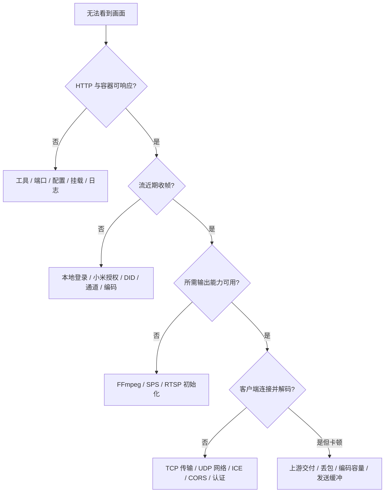

# 🔍 故障排查

上一篇：[04-源码开发与构建包.md](04-源码开发与构建包.md)

先判断失败在哪一层，再检查对应配置。容器健康、媒体就绪和客户端实际播放是不同结果，不应仅凭一个绿色状态结束排查。

## 🧭 按链路定位



先在部署目录执行：

```bash
bash deploy.sh status
bash deploy.sh logs
```

日志命令只返回最近 100 行。必要时在受控终端使用对应 Compose 服务日志；反馈前删除 Token、密码、Cookie、DID、设备名称及敏感内网信息，不提交 `.deploy` 或其备份。

## 🚀 启动与配置问题

| 现象 | 检查与处理 |
| --- | --- |
| 向导提示 Docker 环境不支持 | 检查原生 Linux、rootful 本机 Unix socket、Compose v2.20+；Desktop/WSL 可构建包，但不支持此 LAN 部署流程 |
| 包架构或镜像校验失败 | 重新取得同一版本的归档和 sha256，按 amd64/arm64 选择；不要修改 `package.env` 绕过检查 |
| 基础镜像、NuGet/npm/apt 下载失败 | 检查 GHCR、MCR、npm、NuGet、Debian 软件源访问；构建源调整使用已核对参数，见构建指南 |
| 配置文件找不到 / 指定路径无效 | Debug 忽略传入路径；指定外置配置运行时使用 `dotnet run -c Release ... -- 配置路径` |
| 报旧顶层配置错误 | 按配置迁移表把媒体段移入 `MediaServer`，把流数组移入 `MediaServer.Rtsp.Streams` |
| 时长解析失败 | 使用数值秒，例如 `15`、`0.8`，不用 TimeSpan 字符串；Docker JSON 不允许注释 |
| 流名称或设备通道重复 | 使用唯一 `StreamId`；DID 和 Channel 的组合不得重复，原始示例的占位项必须替换 |
| 修改配置后没有变化 | 配置无热重载；重启源码宿主，Docker 重新运行向导重建桥接；先核对实际读取文件 |
| 旧 IP 不存在 / 端口冲突 | 不会自动换网卡或端口；先停止、备份，再同步修改部署地址，端口冲突按部署指南处理 |
| 权限、证书或凭据文件读取失败 | 核对文件存在、UID/GID 10001 与目录权限、挂载路径；不要用 chmod 777 或清空授权数据解决 |

## 🔑 Miloco 登录与关键帧

**本地登录失败**：终端输入的是 Miloco 本地密码，不是小米账号密码；源码 JSON 使用其小写 MD5。修改本地密码后重新运行向导输入新值。不要打印密码或哈希到共享日志。

**小米授权失败**：在 `https://服务器IP:8000` 完成绑定或重新授权。HTTP 200 并不代表业务授权成功；旧 Cookie 失效时需重新登录。固定社区镜像依赖旧协议，不能随意换成新版 OpenClaw 插件实现。

**证书失败**：检查 Miloco 的实际 PEM 是否与桥接挂载的证书一致，权限是否允许读取。证书轮换或恢复后重新核对文件；不要把开启 `AllowInvalidServerCertificate` 当作生产修复。

**一直 `WaitingForKeyFrame` 或周期性出现 `did not provide a key frame in time`**：依次核对设备在线、真实 DID、镜头通道以及 `Codec`。H.264/H.265 必须与 Miloco 输出一致；错误编码会使关键帧一直无法识别。再检查上游是否持续交付视频，增加超时不会创造缺失的帧。

## 🖼️ 截图或媒体就绪失败

截图 404 表示流不存在；503 表示关闭、媒体能力不足或尚无可解码截图。检查 `Snapshot.Enabled`、动态库目录、实际编解码器，以及是否已经收到了关键帧。

Windows `FFmpeg.Path` 指向 FFmpeg 7.1 兼容动态库目录，不是 exe。相对路径按应用输出目录解析；Docker 默认 `/app/native`。即使系统 `ffmpeg` 命令能运行，也要核对 .NET 原生库能否加载和编码器是否可用。

`Snapshot.Interval` 是关键帧截图生成的最小间隔，不是请求超时或定时抓图保证。上游断流时，列表中可能仍显示缓存存在，而健康接口因截图过旧判定不可用。

`mediaAvailable=false` 检查的是完整 FFmpeg 能力。缺少库时 RTSP 原编码仍可工作，但整体 `ready` 不会因此变为 true。按接口文档逐项查看 `receiving`、`snapshotAvailable`、`webRtcAvailable`。

## 🎞️ RTSP 无法播放

| 现象 | 检查与处理 |
| --- | --- |
| 8554 没有监听 | 网页首次设置可能尚未完成，查看 `/api/rtsp/setup` 的 configured/listening |
| 首次设置 400 | 用户名限制为 1–64 位字母、数字、点、下划线、连字符；密码不能纯空白或包含控制字符 |
| 首次设置 409 | 已初始化；当前没有网页改密接口，使用交互 `credentials` 查看已存凭据 |
| 首次设置 503 | 检查凭据目录权限、可写挂载和 RTSP 端口占用；失败不代表可删除已有状态 |
| 认证失败 | 使用网页设置的新凭据；旧部署切换网页模式后须首次重设，不沿用旧密码 |
| Unsupported Transport / 461 | 播放器选择 RTSP over TCP；服务不支持 UDP RTP |
| 连接成功但黑屏 | 检查源编码、关键帧、客户端 H.265 支持；用 JPEG/收帧状态区分上游失败与播放器问题 |

忘记密码时先用受控交互终端执行 `bash deploy.sh credentials`。不删除 `rtsp-state` 或手工覆盖文件来规避损坏检查；文件恢复按完整备份与权限处理。

## 📺 WebRTC 与浏览器

- **API 请求无法读取**：核对完整 API URL、监听地址、Token、`AllowedOrigins` 的页面源；`localhost` 与 `127.0.0.1` 不同。检查浏览器本地网络权限、HTTPS 页面调用 HTTP 的混合内容限制。
- **创建会话 503**：检查 H.264 参数集、H.265 转码能力和 UDP 端口绑定；等待真实关键帧，不能把 SDP offer 成功当作视频可播放。
- **创建会话 429**：已达到每流 peer 上限；停止旧观看者、清理旧会话，再核对服务端回收，而非先无限增大上限。
- **answer 后停在连接中**：检查 UDP 50000–50100、防火墙、访客 Wi-Fi/AP/VLAN 隔离和 ICE 地址；HTTP 同源代理不会代理视频 UDP。
- **会话 API 404**：会话可能已过期或媒体超时回收；创建新会话，不复用旧 ID。清理阶段 DELETE 的 404 可视为已经释放。
- **运行很久后停播**：刷新资源确保使用新版前端；查看媒体超时与 ICE 日志。页面可见且联网时前端会检查解码进度并重建会话；后台/离线场景等待恢复，不等于已证明通宵稳定。

## 📉 卡顿、帧率与资源

先核对上游实际帧率与收帧空档，再看服务器转码耗时、CPU/内存、RTSP 客户端和浏览器丢包/解码统计。源帧率、服务端输出帧率、客户端解码帧率和渲染流畅度不能相互替代；平均约 20 fps 也可能包含数秒空档。

H.265 WebRTC 使用 CPU 转码。新部署默认 H.264 输出上限 1920×1080；增加到 4K 或增加并发前须实测。降低转码尺寸、采用更快 preset 或减少观看者可用于容量排查，不影响原编码 RTSP/JPEG。H.264 源走直通，不按 H.265 转码配置降分辨率。

增加发送缓冲会增加延迟，也不能解决持续上游断流。`NominalFrameRate` 只是回退时钟，不是摄像头帧率控制。特定 N100 与摄像头的历史参数、成功和失败测量见 [服务器性能记录](SERVER_PERFORMANCE.md)，不能作为其他主机的性能承诺。

## 📨 提交问题时提供什么？

提供源码提交或包版本、架构、原生 Linux/Desktop 环境、部署方式、摄像头型号及编码、复现步骤、脱敏配置片段、状态结果和相应时段日志。说明问题发生于登录、收帧、截图、RTSP 还是 WebRTC，是否有多个观看者、页面后台运行或网络变化。

分享性能结果时注明测量时长、源与输出尺寸、实际帧率、丢包及最长停顿。保留失败结果；不要只提供健康检查截图。现有历史记录中的测试工具已移除，不应按旧路径执行命令。

---

上一篇：[04-源码开发与构建包.md](04-源码开发与构建包.md)
