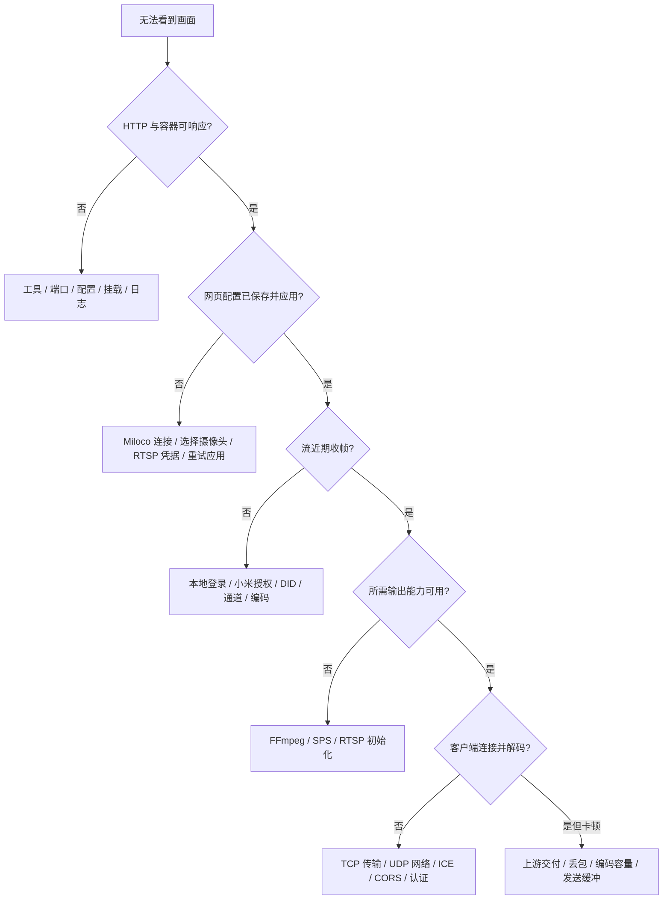

# 🔍 故障排查

上一篇：[04-源码开发与构建包.md](04-源码开发与构建包.md)

先判断失败在哪一层，再检查对应配置。容器健康、媒体就绪和客户端实际播放是不同结果，不应仅凭一个绿色状态结束排查。

## 🧭 按链路定位



先在部署目录执行：

```bash
bash deploy.sh status
bash deploy.sh logs
```

日志命令只返回最近 100 行。必要时在受控终端使用对应 Compose 服务日志；反馈前删除 Token、密码、Cookie、DID、设备名称及敏感内网信息，不提交 `.deploy` 或其备份。

**先确认是否完成网页初始化**：没有已保存的 SQLite 配置时，HTTP 可以正常响应，摄像头列表为空、RTSP 不监听，`ready: false` 是正常状态。桥接容器健康检查使用 `live`，不会代替网页配置、真实收帧和播放验收。初始化步骤见 [桥接服务部署](01-桥接服务部署.md)。

## 🚀 启动与配置问题

| 现象 | 检查与处理 |
| --- | --- |
| 向导提示 Docker 环境不支持 | 检查原生 Linux、rootful 本机 Unix socket、Compose v2.20+；Desktop/WSL 可构建包，但不支持此 LAN 部署流程 |
| 包架构或镜像校验失败 | 重新取得同一版本的归档和 sha256，按 amd64/arm64 选择；不要修改 `package.env` 绕过检查 |
| 基础镜像、NuGet/npm/apt 下载失败 | 检查 GHCR、MCR、npm、NuGet、Debian 软件源访问；构建源调整使用已核对参数，见构建指南 |
| 配置文件找不到 / 指定路径无效 | Debug 忽略传入路径；指定外置配置运行时使用 `dotnet run -c Release ... -- 配置路径` |
| 报旧顶层配置错误 | 媒体参数移入 `MediaServer`；摄像头列表改由网页选择，不再移入 JSON 的 `MediaServer.Rtsp.Streams` |
| 时长解析失败 | 使用数值秒，例如 `15`、`0.8`，不用 TimeSpan 字符串；Docker JSON 不允许注释 |
| 流名称或设备通道重复 | 网页使用 1–64 位英文字母、数字、连字符或下划线的 `StreamId`，首位为字母或数字；忽略大小写后唯一，DID 与 Channel 的组合也不能重复 |
| 改 JSON 中的 Miloco / 摄像头 / RTSP 密码没有变化 | Sample 从 SQLite 读取这些用户配置，旧字段不会覆盖网页设置；进入主页面“重新配置”保存 |
| 修改基础参数后没有变化 | JSON 的监听、拉流和媒体参数在启动时读取；重启源码宿主，Docker 停止后重新运行向导，并核对实际读取文件 |
| 旧 IP 不存在 / 端口冲突 | 不会自动换网卡或端口；先停止、备份，再同步修改部署地址，端口冲突按部署指南处理 |
| 权限、证书或数据库读取失败 | 核对文件存在、应用状态目录 UID/GID 10001、证书与数据库挂载路径、磁盘空间；不要用 chmod 777 或清空授权数据解决 |
| 本地开发每次又进入初始化 / 看到了另一实例的配置 | 检查 `MICAMERA_DATA_DIRECTORY` 和运行用户；未指定时使用用户的 `LocalApplicationData/MiCamera.Net/settings.db`，基础 JSON 的路径不决定数据库目录 |
| SQLite 版本不支持或结构无效 | 使用与数据库匹配的程序版本，或恢复升级前完整备份；服务不会覆盖不兼容数据库，不直接删库重建 |

## ⚙️ 网页初始化与配置保存

| 现象 | 检查与处理 |
| --- | --- |
| `/api/rtsp/setup` 返回 404 | 旧接口已移除；使用 `/api/setup` 查看状态，通过网页或 `PUT /api/settings` 保存整组配置 |
| 后端 API 返回 401 | 核对 HTTP Bearer Token；它不是 Miloco PIN 或 RTSP 密码。Docker 前端默认通过同源代理，无需手工填 Token |
| 获取摄像头 / 保存返回 400 | 核对 Miloco 地址格式、六位数字 PIN、至少一路流、名称和通道约束；首次或修改 RTSP 用户名时必须填密码 |
| 获取摄像头 / 保存返回 502 | 后端无法完成 Miloco 连接、本地登录、小米授权或读取设备列表；结合页面错误检查上游，不把它当作 API Token 错误 |
| 保存返回 409 | 配置已被另一页面更新；重新打开“重新配置”读取最新版本，再编辑保存 |
| 保存返回 503 | 检查数据目录写入权限、SQLite、磁盘与 RTSP 端口；配置可能已经保存，先读取状态再重试 |
| 提示“配置已保存但尚未生效” | 查看 `/api/setup` 的 `applyPending` / `listening`，点击“重试应用已保存的配置”，对应 `POST /api/setup/activate` |
| 保存成功但暂时没有画面 | 保存仅表示配置已应用，仍需等待上游连接和关键帧；随后查看 `receiving` 与媒体能力 |
| 保存后正在看的视频断开 | 重新配置会关闭旧 RTSP / WebRTC 播放连接，回到主页面或播放器重新连接 |

网页“连接后端 API”填写的是 MiCamera HTTP 地址，Docker 默认是当前网站的同源代理；“配置 Miloco”填写的是 `https://服务器IP:8000`。两个入口不能互换。本地前端直连 API 时，还需匹配 CORS 和 Token。

服务端不会返回 PIN、RTSP 密码或认证摘要。重新配置时 PIN 留空可保留已存值；RTSP 用户名未变时密码也可留空。忘记 RTSP 密码可以在“重新配置”中设置新密码，`bash deploy.sh credentials` 只提示网页入口，不再显示凭据。

## 🔑 Miloco 登录、设备发现与关键帧

**本地登录失败**：网页填写的是 Miloco 本地六位数字 PIN，不是小米账号密码。桥接自动计算 MD5，不需要手工向 Sample JSON 填入密码或哈希。Miloco PIN 变化后，在前端“重新配置”中填写新值。使用代码配置的 SDK 宿主时，`MilocoOptions.Password` 仍接收小写 MD5。

**小米授权失败**：在 `https://服务器IP:8000` 完成绑定或重新授权。HTTP 200 并不代表业务授权成功；旧 Cookie 失效时需重新登录。固定社区镜像依赖旧协议，不能随意换成新版 OpenClaw 插件实现。

**摄像头列表为空或设备缺失**：先在 Miloco 核对账号、家庭 / 设备范围和摄像头在线状态，再在前端刷新。`/api/setup/discover` 返回上游发现的设备，`/api/cameras` 仅返回已选择保存的流；两份列表不同。已保存设备不在当前 Miloco 列表时，保存前需要刷新并调整选择。

**证书失败**：检查 Miloco 的实际 PEM 是否与桥接挂载的证书一致，权限是否允许读取。证书轮换或恢复后重新核对文件；不要把开启 `AllowInvalidServerCertificate` 当作生产修复。

**一直 `WaitingForKeyFrame` 或周期性出现 `did not provide a key frame in time`**：依次核对设备在线、真实 DID、镜头通道以及 `Codec`。H.264/H.265 必须与 Miloco 输出一致；错误编码会使关键帧一直无法识别。再检查上游是否持续交付视频，增加超时不会创造缺失的帧。

## 🖼️ 截图或媒体就绪失败

截图 404 表示流不存在或尚未保存摄像头；503 表示关闭、媒体能力不足或尚无可解码截图。检查 `MediaServer.Snapshot.Enabled`、动态库目录、实际编解码器，以及是否已经收到了关键帧。

Windows `MediaServer.FFmpeg.Path` 指向 FFmpeg 7.1 兼容动态库目录，不是 exe。相对路径按应用输出目录解析；Docker 默认 `/app/native`。即使系统 `ffmpeg` 命令能运行，也要核对 .NET 原生库能否加载和编码器是否可用。

`MediaServer.Snapshot.Interval` 是关键帧截图生成的最小间隔，不是请求超时或定时抓图保证。上游断流时，列表中可能仍显示缓存存在，而健康接口因截图过旧判定不可用。

`mediaAvailable=false` 检查的是完整 FFmpeg 能力。缺少库时 RTSP 原编码仍可工作，但整体 `ready` 不会因此变为 true。按接口文档逐项查看 `receiving`、`snapshotAvailable`、`webRtcAvailable`。

## 🎞️ RTSP 无法播放

| 现象 | 检查与处理 |
| --- | --- |
| 8554 没有监听 | 先完成整组网页配置，查看 `/api/setup` 的 `configured`、`listening` 和 `applyPending`；检查 TCP 8554 占用 |
| 认证失败 | 使用当前网页设置的用户名与密码；改密后重新建立播放器连接，旧文件配置升级后需网页重新设置 |
| Unsupported Transport / 461 | 播放器选择 RTSP over TCP；服务不支持 UDP RTP |
| 连接成功但黑屏 | 检查源编码、关键帧、客户端 H.265 支持；用 JPEG/收帧状态区分上游失败与播放器问题 |

RTSP 认证信息与摄像头配置保存在 `.deploy/micamera-state/settings.db`，旧的 `rtsp-state/credentials.json` 不再被读取。改密使用网页，数据库损坏或恢复问题按完整备份与权限处理，不通过手工覆盖旧凭据文件修复。

## 📺 WebRTC 与浏览器

- **API 请求无法读取**：核对完整 API URL、监听地址、Token、`AllowedOrigins` 的页面源；`localhost` 与 `127.0.0.1` 不同。检查浏览器本地网络权限、HTTPS 页面调用 HTTP 的混合内容限制。
- **创建会话 503**：检查 H.264 参数集、H.265 转码能力和 UDP 端口绑定；等待真实关键帧，不能把 SDP offer 成功当作视频可播放。
- **创建会话 429**：已达到每流 peer 上限；停止旧观看者、清理旧会话，再核对服务端回收，而非先无限增大上限。
- **answer 后停在连接中**：检查 UDP 50000–50100、防火墙、访客 Wi-Fi/AP/VLAN 隔离和 ICE 地址；HTTP 同源代理不会代理视频 UDP。
- **会话 API 404**：会话可能已过期或媒体超时回收；创建新会话，不复用旧 ID。清理阶段 DELETE 的 404 可视为已经释放。
- **运行很久后停播**：刷新资源确保使用新版前端；查看媒体超时与 ICE 日志。页面可见且联网时前端会检查解码进度并重建会话；后台/离线场景等待恢复，不等于已证明通宵稳定。

## 📉 卡顿、帧率与资源

先核对上游实际帧率与收帧空档，再看服务器转码耗时、CPU/内存、RTSP 客户端和浏览器丢包/解码统计。源帧率、服务端输出帧率、客户端解码帧率和渲染流畅度不能相互替代；平均约 20 fps 也可能包含数秒空档。

H.265 WebRTC 使用 CPU 转码。新部署默认 H.264 输出上限 1920×1080；增加到 4K 或增加并发前须实测。降低转码尺寸、采用更快 preset 或减少观看者可用于容量排查，不影响原编码 RTSP/JPEG。H.264 源走直通，不按 H.265 转码配置降分辨率。

增加发送缓冲会增加延迟，也不能解决持续上游断流。网页的回退帧率对应 `NominalFrameRate`，不是摄像头帧率控制。特定 N100 与摄像头的历史参数、成功和失败测量见 [服务器性能记录](troubleshooting/SERVER_PERFORMANCE.md)，不能作为其他主机的性能承诺。

## 🔄 升级、恢复与地址变化

当前版本升级或重启应保留整个 `.deploy/`，包括基础 JSON、两个 secrets、Miloco 账号数据与证书、SQLite 配置。只恢复 JSON 不能恢复摄像头和 RTSP 凭据。备份前停止服务，并保持原所有权和权限。

从旧文件配置升级时，脚本会备份 `MiCameraConfig.before-web-setup.json` 并移除由网页管理的字段，但不会把旧 PIN、流列表和 RTSP 密码导入 SQLite。没有 SQLite 配置的部署需要在网页重新初始化；旧 `miloco_password_md5`、`rtsp-state` 或其他备份文件的存在不表示当前配置已经恢复。

检测到旧的 `bridge.env` / `miloco.env` 时，先备份再按 [部署指南](01-桥接服务部署.md) 处理布局。服务器 IP 变化时，同步修改部署 IP 和 JSON 监听 / UDP / CORS 地址，启动后再通过“重新配置”更新 Miloco BaseUrl，不直接编辑数据库。

## 📨 提交问题时提供什么？

提供源码提交或包版本、架构、原生 Linux/Desktop 环境、部署方式、摄像头型号及编码、复现步骤、脱敏配置片段、状态结果和相应时段日志。说明问题发生于登录、收帧、截图、RTSP 还是 WebRTC，是否有多个观看者、页面后台运行或网络变化。

分享性能结果时注明测量时长、源与输出尺寸、实际帧率、丢包及最长停顿。保留失败结果；不要只提供健康检查截图。现有历史记录中的测试工具已移除，不应按旧路径执行命令。

---

上一篇：[04-源码开发与构建包.md](04-源码开发与构建包.md)
